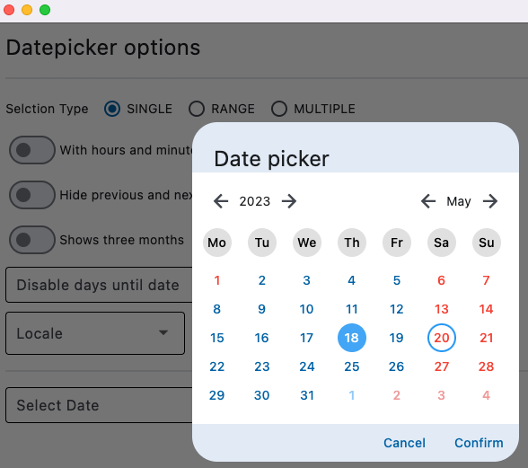
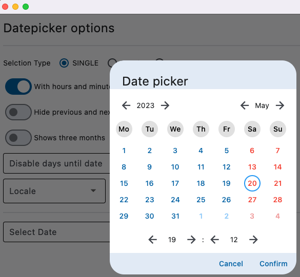
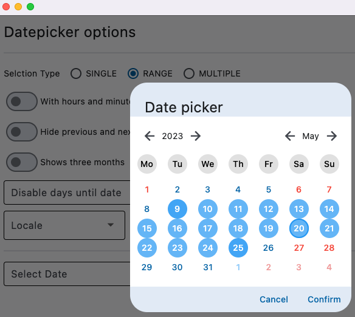
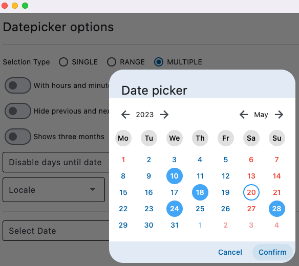
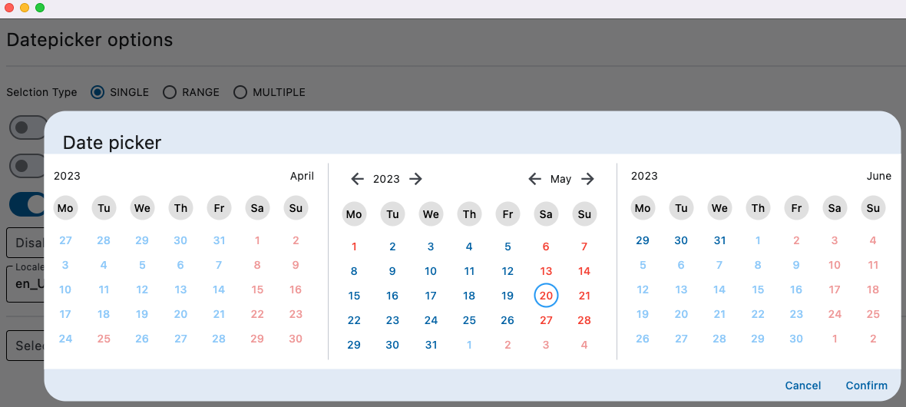
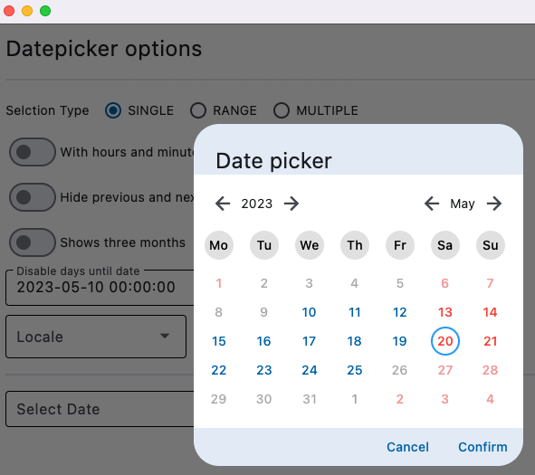
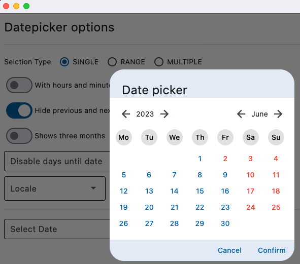
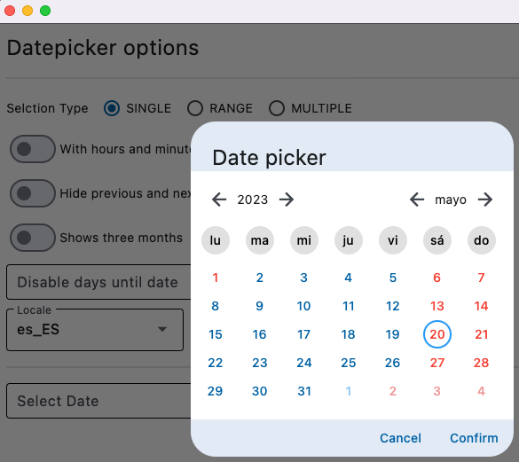

# Flet date picker

Naive flet datepicker

features:
- localization
- selection types SINGLE, MULTIPLE, RANGE
- disable to date and from date
- show 3 months
- holidays
- first day of week
- select datetime

---

**Datepicker**
- 

**Datetimepicker**

- 

**Range selection**

- 

**Multiple selection**

- 

**Show 3 months**

- 

**Disabled dates**

- 

**prev/next month days hidden**

- 

**locale**
- 

---

python version 3.10
flet 0.7.1
