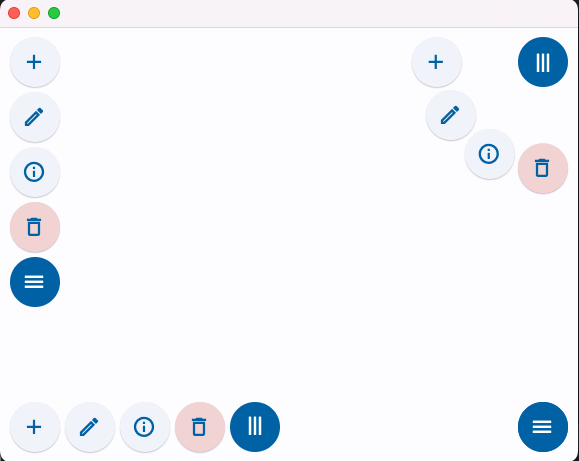

# AnimatedMenuButton

Menu button that is intended to be placed in one of the four corners of a Stack.

When you click on tbe button, it animates to reveal menu items as round buttons.

Image below shows a closed menu, a vertical menu, a horizontal menu and a curved menu.



## Usage

Here is an example of creating the top right curved menu of the image above:

```python
import flet
from flet import ButtonStyle, Stack, colors, icons

from animated_menu_button import AnimatedMenuButton, MenuItem

def dummy_menu_handler(event):
    print("Clicked")

def main(page: Page):
    menu_items = [
        MenuItem(icon=icons.ADD_OUTLINED, handler=dummy_menu_handler),
        MenuItem(icon=icons.EDIT_OUTLINED, handler=dummy_menu_handler),
        MenuItem(icon=icons.INFO_OUTLINED, handler=dummy_menu_handler),
        MenuItem(
            icon=icons.DELETE_OUTLINE,
            handler=dummy_menu_handler,
            style=ButtonStyle(bgcolor=colors.ERROR_CONTAINER),
        ),
    ]

    page.add(Stack(expand=True, controls=[
        AnimatedMenuButton(menu_items, corner="top right", direction="curve down")
    ]))

    page.update()

flet.app(target=main)
```

Default behavior if you do not provide a corner or direction is a vertical menu in the
top left corner.

`AnimatedMenuButton` has the following init parameters:
- `menu_items: List[MenuItem]`
- `corner: Corner = "top left", "top right", "bottom left", "bottom right"`
- `direction: Direction = "vertical", "horizontal", "curve up", "curve down"`
- `margin: int = 8` (distance from the selected corner)
- `menu_button_icon: str = icons.MENU`
- `menu_button_style: ButtonStyle = None`
- `menu_item_size: int = 50`
- `menu_item_gap: int = 5`
- `menu_open_duration: int = 300  # milliseconds`
- `rotate_on_opening: bool = True`

Any additional positional and keyword arguments are passed to the Stack that holds the menu button
and menu items.

`MenuItem` has the following attributes:
- `icon: str`
- `handler: Callable`
- `style: ButtonsStyle = None`
