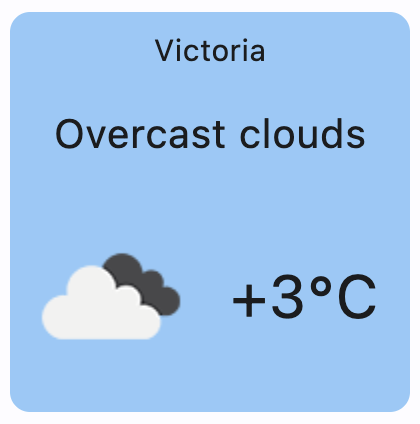

# Weather

`Weather` widget is used for displaying current local weather. It uses free Open Weather Map API (https://home.openweathermap.org/).

To use `Weather` control, create an API key on https://home.openweathermap.org/ and save it as `OWM_API_KEY` environment variable.

`WetherAsync` is prefereable to `Weather` in multi-user web apps to avoid creating multiple threads.

## Examples

### Weather widget



```python
import flet as ft

from weather_widget.weather_widget import Weather


def main(page: ft.Page):

    weather_widget = Weather()

    page.add(weather_widget)

ft.app(main)

```

## Properties

### `color`

Background [color](https://flet.dev/docs/guides/python/colors#hex-value) of the Weather widget. The default value is `ft.Colors.BLUE_200`.

### `height`

Height of `Weather` widget in virtual pixels that can be specified when creating a `Widget` instance. The default value is `200`.

### `width`

Width of `Weather` widget in virtual pixels that can be specified when creating a `Widget` instance. The default value is `200`.
