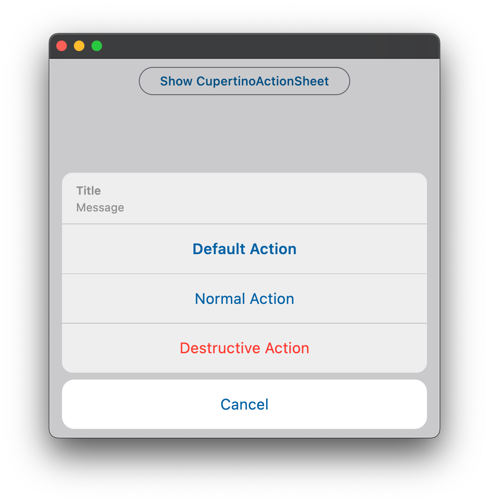

::: flet.CupertinoActionSheetAction

## Examples

[Live example](https://flet-controls-gallery.fly.dev/buttons/cupertinoactionsheetaction)

### Example 1

```python
import flet as ft

def main(page):
    page.horizontal_alignment = ft.CrossAxisAlignment.CENTER

    def handle_click(e):
        page.add(ft.Text(f"Action clicked: {e.control.content.value}"))
        page.close(bottom_sheet)

    action_sheet = ft.CupertinoActionSheet(
        title=ft.Row([ft.Text("Title")], alignment=ft.MainAxisAlignment.CENTER),
        message=ft.Row([ft.Text("Description")], alignment=ft.MainAxisAlignment.CENTER),
        cancel=ft.CupertinoActionSheetAction(
            content=ft.Text("Cancel"),
            on_click=handle_click,
        ),
        actions=[
            ft.CupertinoActionSheetAction(
                content=ft.Text("Default Action"),
                is_default_action=True,
                on_click=handle_click,
            ),
            ft.CupertinoActionSheetAction(
                content=ft.Text("Normal Action"),
                on_click=handle_click,
            ),
            ft.CupertinoActionSheetAction(
                content=ft.Text("Destructive Action"),
                is_destructive_action=True,
                on_click=handle_click,
            ),
        ],
    )

    bottom_sheet = ft.CupertinoBottomSheet(action_sheet)

    page.add(
        ft.CupertinoFilledButton(
            "Open CupertinoBottomSheet",
            on_click=lambda e: page.open(bottom_sheet),
        )
    )


ft.run(main)
```

{width="80%"}
/// caption
///
