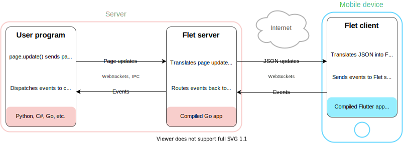

This article covers Flet's vision for going mobile and provides a roadmap.

## Server-Driven UI

Flet is a Server-driven UI (SDUI) framework. SDUI is an emerging technology which is the best described in [Technology Radar post](https://www.thoughtworks.com/en-ca/radar/techniques/server-driven-ui):

> Server-driven UI separates the rendering into a generic container in the mobile app while the structure and data for each view is provided by the server. This means that changes that once required a round trip to an app store can now be accomplished via simple changes to the responses the server sends.

Companies like [DoorDash](https://doordash.engineering/2021/08/24/improving-development-velocity-with-generic-server-driven-ui-components/), [Airbnb](https://medium.com/airbnb-engineering/a-deep-dive-into-airbnbs-server-driven-ui-system-842244c5f5), [Lyft](https://podcasts.apple.com/us/podcast/server-driven-ui-with-kevin-fang-jeff-hurray/id1453587931?i=1000509742062) and others have been successfully implementing Server-driven UI in their mobile apps to reduce time-to-market.

### Flet approach

Flet is going to implement Server-Driven UI approach where program written in Python or other language is running on the server and only a thin client - either standalone Flutter app (`.apk` or `.ipa` package) in app store or a Flutter widget as a part of another app - is delivered to a mobile:

Once SDUI experience is ready we'll start working on a [standalone mobile package](#standalone-mobile-package-for-flet-app).

## Roadmap

To provide the best experience for Flet apps on mobile platforms, we plan to release the following items by the end of this year:

### Flet widget for Flutter

The first step we are going to do is to separate Flet client into a Flutter widget and publish the package at https://pub.dev.
Flet widget could be then integrated by mobile developers into existing or new Flutter apps for adding dynamic server-driven UI experiences to the core app functionality. A new Flutter app could be also created with a single Flet widget just for the purpose of hosting a complete Flet app.

Developers will follow Flutter guide for packaging, signing and distributing their apps to [Android](https://docs.flutter.dev/deployment/android), [iOS](https://docs.flutter.dev/deployment/ios), [Linux](https://docs.flutter.dev/deployment/linux), [macOS](https://docs.flutter.dev/deployment/macos) or [Windows](https://docs.flutter.dev/deployment/windows) platforms.

Flet team will provide sample CI pipelines to automate packaging, signing and publishing of Flutter apps.

### Flet Studio for iOS and Android

The next step is a standalone "Flet Studio" app (the name is not final) in App Store and Google Play for "testing mobile experiences developed with Flet framework". Developers or beta testers will be able to "register" URL of their hosted Flet app within Flet Studio and instantly see how it performs on a mobile device.

### White-labeled Flet mobile app

We are going to provide a guide and CI pipeline for automatic publishing of white-labeled Flet app to a user App Store or Google Play account. This app will be "pinned" to a specific app URL and could additionally bundle app assets (media, fonts) to minimize network usage.

### Standalone mobile package for Flet app

We are going to investigate the way and develop a prototype for bundling together Flet framework, user program, language runtime and all dependencies into a standalone mobile package (`.apk` or `.ipa` package), so Flet program does not require a web server.

### Embedding Flet into native apps
 
We are going to provide a guide, sample apps and CI pipeline to integrate Flet widget into existing native Android and iOS apps (not developed with Flutter) using [Flutter Add-to-App](https://docs.flutter.dev/development/add-to-app) feature. [Put Flutter to work](https://medium.com/flutter/put-flutter-to-work-95f5fdcc592e) article gives a real-world example on how to integrate Flutter into existing mobile app.
