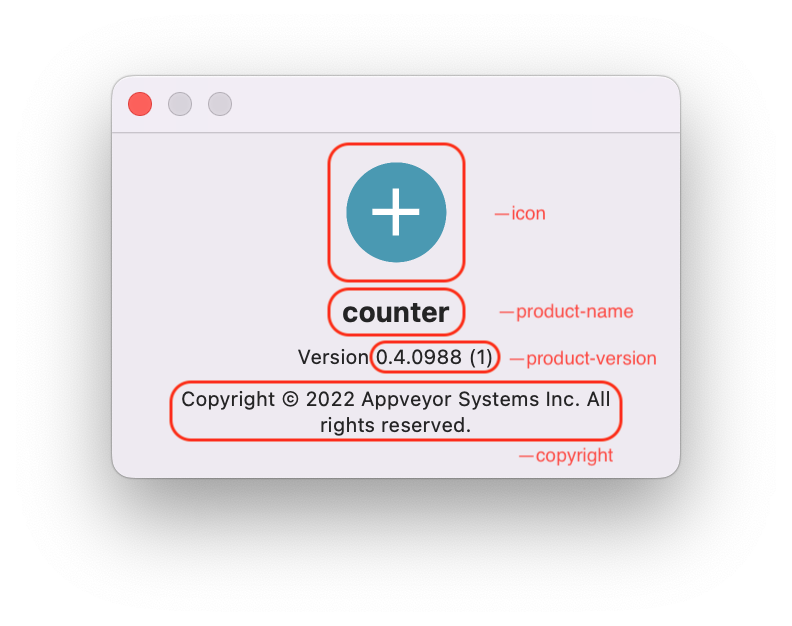

/// admonition | A better way to package is here
    type: danger

You can now use `flet build` command to package your Flet app into executable or install bundle for
macOS, Windows and Linux.

`flet build` does not longer rely on PyInstaller like `flet pack` does, but uses Flutter SDK to produce a fast, offline, fully customizable (your own icons, about dialog and metadata) executable for Windows, Linux and macOS with Python runtime embedded into executable and running in-process.

[Follow this guide for desktop packaging](../publish/index.md)
///

Flet Python app and all its dependencies can be packaged into an executable and user can run it on their computer without installing a Python interpreter or any modules.

Flet wraps [PyInstaller](https://pyinstaller.org/en/stable/index.html) API to package Flet Python app and all its dependencies into a single package for Windows, macOS and Linux. To create Windows package, PyInstaller must be run on Windows; to build Linux app, it must be run on Linux; and to build macOS app - on macOS.

Start from installing PyInstaller:

```
pip install pyinstaller
```

Navigate to the directory where your `.py` file is located and build your app with the following command:

```
flet pack your_program.py
```

Your bundled Flet app should now be available in `dist` folder. Try running the program to see if it works.

On macOS:

```
open dist/your_program.app
```

on Windows:

```
dist\your_program.exe
```

on Linux:

```
dist/your_program
```

Now you can just zip the contents of `dist` folder and distribute to your users! They don't need Python or Flet installed to run your packaged program - what a great alternative to Electron!

By default, an executable/bundle has the same name as a Python script. You can change it with `--name` argument:

```
flet pack your_program.py --name bundle_name
```

## Customizing package icon

Default bundle app icon is diskette which might be confusing for younger developers missed those ancient times when [floppy disks](https://en.wikipedia.org/wiki/Floppy_disk) were used to store computer data.

You can replace the icon with your own by adding `--icon` argument:

```
flet pack your_program.py --icon <your-image.png>
```

PyInstaller will convert provided PNG to a platform specific format (`.ico` for Windows and `.icns` for macOS), but you need to install [Pillow](https://pillow.readthedocs.io/en/stable/) module for that:

```
pip install pillow
```

## Packaging assets

Your Flet app can include [assets](assets.md). Provided app assets are in `assets` folder next to `your_program.py` they can be added to an application package with `--add-data` argument, on macOS/Linux:

```
flet pack your_program.py --add-data "assets:assets"
```

On Windows `assets;assets` must be delimited with `;`:

```
flet pack your_program.py --add-data "assets;assets"
```

## Customizing macOS bundle

macOS bundle details can be customized with the following `flet pack` macOS-specific arguments:

* `--product-name` - display name of macOS bundle, shown in Dock, Activity Monitor, About dialog.
* `--product-version` - bundle version shown in "About" dialog.
* `--copyright` - copyright notice shown in "About" dialog.
* `--bundle-id` unique bundle ID.



## Customizing Windows executable metadata

Windows executable "Details" properties dialog can be customized with the following `flet pack` arguments:

* `--product-name` - "Product name" field.
* `--product-version` - "Product version" field.
* `--file-version` - "File version" field.
* `--file-description` - "File description" field, also program display name in Task Manager.
* `--copyright` - "Copyright" field.

## Using CI for multi-platform packaging

To create an app package with PyInstaller for specific OS it must be run on that OS.

If you don't have an access to Mac or PC you can bundle your app for all three platforms with [AppVeyor](https://www.appveyor.com) - Continuous Integration service for Windows, Linux and macOS. In short, Continuous Integration (CI) is an automated process of building, testing and deploying (Continuous Delivery - CD) application on every push to a repository.

AppVeyor is free for open source projects hosted on GitHub, GitLab and Bitbucket. To use AppVeyor, push your app to a repository within one of those source-control providers.

/// admonition
    type: note
AppVeyor is the company behind Flet.
///

To get started with AppVeyor [sign up for a free account](https://ci.appveyor.com/signup).

Click "New project" button, authorize AppVeyor to access your GitHub, GitLab or Bitbucket account, choose a repository with your program and create a new project.

Now, to configure packaging of your app for Windows, Linux and macOS, add file with [the following contents](https://github.com/flet-dev/python-ci-example/blob/main/appveyor.yml) into the root of your repository `appveyor.yml`. `appveyor.yml` is a build configuration file, or CI workflow, describing build, test, packaging and deploy commands that must be run on every commit.

/// admonition
    type: note
You can just fork [flet-dev/python-ci-example](https://github.com/flet-dev/python-ci-example) repository and customize it to your needs.
///

When you push any changes to GitHub repository, AppVeyor will automatically start a new build:


What that [CI workflow](https://ci.appveyor.com/project/flet-dev/python-ci-example) does on every push to the repository:

* Clones the repository to a clean virtual machine.
* Installs app dependencies using `pip`.
* Runs `flet pack` to package Python app into a bundle for **Windows**, **macOS** and **Ubuntu**.
* Zip/Tar app bundles and uploads them to ["Artifacts"](https://ci.appveyor.com/project/flet-dev/python-ci-example/build/job/g2j2lhstv04eyxcm/artifacts).
* Uploads app bundles to [**GitHub releases**](https://github.com/flet-dev/python-ci-example/releases) when a new tag is pushed. Just push a new tag to make a release!

/// admonition | GITHUB_TOKEN 
    type: note 
`GITHUB_TOKEN` in `appveyor.yml` is a GitHub Personal Access Token (PAT) used by AppVeyor to publish created packages to repository "Releases". You need to generate your own token and replace it in `appveyor.yml`. Login to your GitHub account and navigate to [Personal access token](https://github.com/settings/tokens) page. Click "Generate new token" and select "public_repo" or "repo" scope for public or private repository respectively. Copy generated token to a clipboard and return to AppVeyor Portal. Navigate to [Encrypt configuration data](https://ci.appveyor.com/tools/encrypt) page and paste token to "Value to encrypt" field, click "Encrypt" button. Put encrypted value under `GITHUB_TOKEN` in your `appveyor.yml`.
///

Configure AppVeyor for your Python project, push a new tag to a repository and "automagically" get desktop bundle for all three platforms in GitHub releases! 🎉


In addition to [GitHub Releases](https://www.appveyor.com/docs/deployment/github/), you can also configure releasing of artifacts to [Amazon S3 bucket](https://www.appveyor.com/docs/deployment/amazon-s3/) or [Azure Blob storage](https://www.appveyor.com/docs/deployment/azure-blob/).