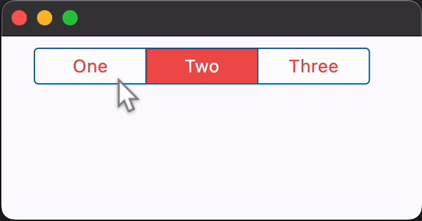

## Examples

[Live example](https://flet-controls-gallery.fly.dev/buttons/cupertinosegmentedbutton)

### Basic Example

```python
--8<-- "../../examples/controls/cupertino_segmented_button/basic.py"
```

{width="80%"}
/// caption
///

### Adjusting segments padding

```python
--8<-- "../../../../examples/controls/cupertino_segmented_button/segments_padding.py"
```

::: flet.CupertinoSegmentedButton
