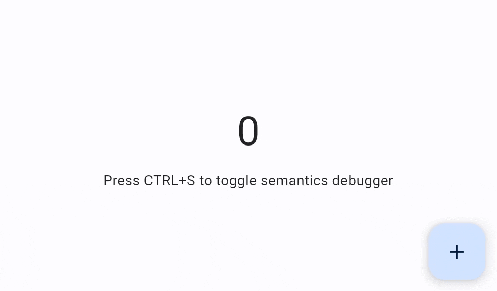

Flet is based on [Flutter](https://flutter.dev) which includes first-class framework support for accessibility in addition to that provided by the underlying operating system.

## Screen readers

For mobile, screen readers ([TalkBack](https://support.google.com/accessibility/android/answer/6283677?hl=en), [VoiceOver](https://www.apple.com/lae/accessibility/iphone/vision/)) enable visually impaired users to get spoken feedback about the contents of the screen and interact with the UI via gestures on mobile and keyboard shortcuts on desktop. Turn on VoiceOver or TalkBack on your mobile device and navigate around your app.

For web, the following screen readers are currently supported:

Mobile Browsers:

* iOS - VoiceOver
* Android - TalkBack

Desktop Browsers:

* MacOS - VoiceOver
* Windows - JAWs & NVDA

Screen Readers users on web will need to toggle "Enable accessibility" button to build the semantics tree.

### Text

Use `Text.semantics_label` property to override default Text control semantics.

### Buttons

All buttons with text on them generate proper semantics.

Use `tooltip` property to add screen reader semantics for `IconButton`, `FloatingActionButton` and `PopupMenuButton` buttons.

### `TextField` and `Dropdown`

Use `TextField.label` and `Dropdown.label` properties to add screen reader semantics to those controls.

### Custom semantics

For any specific requirements use [`Semantics`](/docs/controls/semantics) control.

### Debugging semantics

Set `page.show_semantics_debugger` to `True` to show an overlay that shows the accessibility information reported by the framework.

You can implement a specific [keyboard shortcut](keyboard-shortcuts.md) to conveniently toggle semantics debugger during app development:



```python
import flet as ft

def main(page: ft.Page):
    page.title = "Flet counter example"
    page.vertical_alignment = ft.MainAxisAlignment.CENTER
    page.horizontal_alignment = ft.CrossAxisAlignment.CENTER

    def on_keyboard(e: ft.KeyboardEvent):
        print(e)
        if e.key == "S" and e.ctrl:
            page.show_semantics_debugger = not page.show_semantics_debugger
            page.update()

    page.on_keyboard_event = on_keyboard

    txt_number = ft.Text("0", size=40)

    def button_click(e):
        txt_number.value = str(int(txt_number.value) + 1)
        page.update()

    page.add(
        txt_number,
        ft.Text("Press CTRL+S to toggle semantics debugger"),
        ft.FloatingActionButton(
            icon=ft.Icons.ADD, tooltip="Increment number", on_click=button_click
        ),
    )

ft.run(main, view=ft.AppView.WEB_BROWSER)
```
