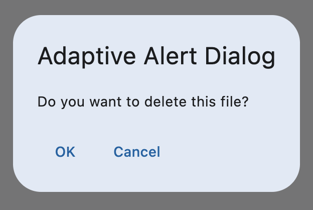
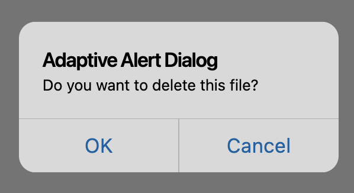
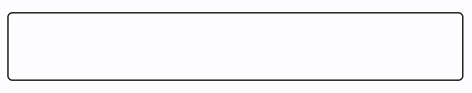

Flet framework allows you to develop adaptive apps which means having a single codebase that
will deliver different look depending on the device's platform.

Below is the example of a very simple app that has a different look on iOS and Android platforms:

```python
import flet as ft


def main(page):

    page.adaptive = True

    page.appbar = ft.AppBar(
        leading=ft.TextButton("New", style=ft.ButtonStyle(padding=0)),
        title=ft.Text("Adaptive AppBar"),
        actions=[
            ft.IconButton(ft.cupertino_icons.ADD, style=ft.ButtonStyle(padding=0))
        ],
        bgcolor=ft.Colors.with_opacity(0.04, ft.CupertinoColors.SYSTEM_BACKGROUND),
    )

    page.navigation_bar = ft.NavigationBar(
        destinations=[
            ft.NavigationBarDestination(icon=ft.Icons.EXPLORE, label="Explore"),
            ft.NavigationBarDestination(icon=ft.Icons.COMMUTE, label="Commute"),
            ft.NavigationBarDestination(
                icon=ft.Icons.BOOKMARK_BORDER,
                selected_icon=ft.Icons.BOOKMARK,
                label="Bookmark",
            ),
        ],
        border=ft.Border(
            top=ft.BorderSide(color=ft.CupertinoColors.SYSTEM_GREY2, width=0)
        ),
    )

    page.add(
        ft.SafeArea(
            ft.Column(
                [
                    ft.Checkbox(value=False, label="Dark Mode"),
                    ft.Text("First field:"),
                    ft.TextField(keyboard_type=ft.KeyboardType.TEXT),
                    ft.Text("Second field:"),
                    ft.TextField(keyboard_type=ft.KeyboardType.TEXT),
                    ft.Switch(label="A switch"),
                    ft.FilledButton(content=ft.Text("Adaptive button")),
                    ft.Text("Text line 1"),
                    ft.Text("Text line 2"),
                    ft.Text("Text line 3"),
                ]
            )
        )
    )


ft.run(main)
```

By setting just `page.adaptive = True` you can make you app looking awesome on both iOS and Android devices:

<div class="grid cards" markdown>

-   **iPhone**

    ---
    {width="80%"}

-   **Android**

    ---
    {width="80%"}

</div>

## Material and Cupertino controls

Most of Flet controls are based on [Material design](https://m3.material.io/).

There is also a number of iOS-style controls in Flet that are called Cupertino controls.

Cupertino controls usually have a matching Material control that has [`adaptive`][flet.AdaptiveControl.adaptive] property
which defaults to`False`. When using a Material control with `adaptive` property set to `True`,
a different control will
be created depending on the platform, for example:
```python
ft.Checkbox(adaptive=True, value=True, label="Adaptive Checkbox")
```

Flet checks the value of [`Page.platform`][flet.Page.platform] property and if it is
`PagePlatform.IOS` or `ft.PagePlatform.MACOS`, Cupertino control will be created;
in all other cases Material control will be created.

/// admonition | Note
    type: note
[`adaptive`][flet.AdaptiveControl.adaptive] property can be set for an individual control or
a container-controls (ex: [`Row`][flet.Row], [`Column`][flet.Column]) that has children controls.
If a container-control is made adaptive, all its children will be adaptive too,
unless `adaptive` property is explicitly set to `False` for a child control.
///

/// details | Material vs Cupertino
    type: example
Below is the list of adaptive Material controls and their matching Cupertino controls:

<div class="grid cards" markdown>

-   [:octicons-arrow-right-24: `AlertDialog`][flet.AlertDialog]

    ---
    {width="45%"}

-   [:octicons-arrow-right-24: `CupertinoAlertDialog`][flet.CupertinoAlertDialog]

    ---
    {width="45%"}

-   [:octicons-arrow-right-24: `Any button in Dialog actions`][flet.Button]

    ---
    {width="45%"}

-   [:octicons-arrow-right-24: `CupertinoDialogAction`][flet.CupertinoDialogAction]

    ---
    {width="45%"}

-   [:octicons-arrow-right-24: `AppBar`][flet.AppBar]

    ---
    {width="45%"}

-   [:octicons-arrow-right-24: `CupertinoAppBar`][flet.CupertinoAppBar]

    ---
    {width="45%"}

-   [:octicons-arrow-right-24: `NavigationBar`][flet.NavigationBar]

    ---
    {width="45%"}

-   [:octicons-arrow-right-24: `CupertinoNavigationBar`][flet.CupertinoNavigationBar]

    ---
    {width="45%"}

-   [:octicons-arrow-right-24: `ListTile`][flet.ListTile]

    ---
    {width="45%"}

-   [:octicons-arrow-right-24: `CupertinoListTile`][flet.CupertinoListTile]

    ---
    {width="45%"}

-   [:octicons-arrow-right-24: `TextField`][flet.TextField]

    ---
    {width="45%"}

-   [:octicons-arrow-right-24: `CupertinoTextField`][flet.CupertinoTextField]

    ---
    {width="45%"}

-   [:octicons-arrow-right-24: `Checkbox`][flet.Checkbox]

    ---
    {width="45%"}

-   [:octicons-arrow-right-24: `CupertinoCheckbox`][flet.CupertinoCheckbox]

    ---
    {width="45%"}

-   [:octicons-arrow-right-24: `Slider`][flet.Slider]

    ---
    {width="45%"}

-   [:octicons-arrow-right-24: `CupertinoSlider`][flet.CupertinoSlider]

    ---
    {width="45%"}

-   [:octicons-arrow-right-24: `Switch`][flet.Switch]

    ---
    {width="45%"}

-   [:octicons-arrow-right-24: `CupertinoSwitch`][flet.CupertinoSwitch]

    ---
    {width="45%"}

-   [:octicons-arrow-right-24: `Radio`][flet.Radio]

    ---
    {width="45%"}

-   [:octicons-arrow-right-24: `CupertinoRadio`][flet.CupertinoRadio]

    ---
    {width="45%"}

-   [:octicons-arrow-right-24: `FilledButton`][flet.FilledButton]

    ---
    {width="45%"}

-   [:octicons-arrow-right-24: `CupertinoFilledButton`][flet.CupertinoFilledButton]

    ---
    {width="45%"}

-   [:octicons-arrow-right-24: `FilledTonalButton`][flet.FilledTonalButton]

    ---
    {width="45%"}

-   [:octicons-arrow-right-24: `CupertinoButton`][flet.CupertinoButton]

    ---
    {width="45%"}

-   [:octicons-arrow-right-24: `IconButton`][flet.IconButton]

    ---
    {width="45%"}

-   [:octicons-arrow-right-24: `CupertinoButton`][flet.CupertinoButton]

    ---
    {width="45%"}

-   [:octicons-arrow-right-24: `ElevatedButton`][flet.ElevatedButton]

    {width="45%"}

    ---
    [:octicons-arrow-right-24: `OutlinedButton`][flet.OutlinedButton]

    {width="45%"}

    ---
    [:octicons-arrow-right-24: `TextButton`][flet.TextButton]

    {width="45%"}

-   [:octicons-arrow-right-24: `CupertinoButton`][flet.CupertinoButton]

    ---
    {width="45%"}

</div>

///

## Custom adaptive controls

While Flet offers a number of [controls](#material-and-cupertino-controls) that will be adapted to a platform

automatically using their [`adaptive`][flet.AdaptiveControl.adaptive] property, there will be
cases when you need more specific adaptive UI presentation, for example, using different
icon, background color, padding, etc., depending on the platform.

With Flet, you can create your own reusable custom controls in Python that will inherit from a Flet control
and implement specific properties you need.

In the example below, we are creating a new `AdaptiveNavigationBarDestination`
[custom control](custom-controls.md) that will be displaying different icon on iOS and Android, and use it
as destination for the [`NavigationBar`][flet.NavigationBar]:

```python
import flet as ft

class AdaptiveNavigationBarDestination(ft.NavigationBarDestination):
    def __init__(self, ios_icon, android_icon, label):
        super().__init__()
        self._ios_icon = ios_icon
        self._android_icon = android_icon
        self.label = label

    def build(self):
        # we can check for platform in build method because self.page is known
        self.icon = (
            self._ios_icon
            if self.page.platform == ft.PagePlatform.IOS
            or self.page.platform == ft.PagePlatform.MACOS
            else self._android_icon
        )

def main(page: ft.Page):
    page.adaptive = True

    page.navigation_bar = ft.NavigationBar(
        selected_index=2,
        destinations=[
            AdaptiveNavigationBarDestination(
                ios_icon=ft.cupertino_icons.PERSON_3_FILL,
                android_icon=ft.Icons.PERSON,
                label="Contacts",
            ),
            AdaptiveNavigationBarDestination(
                ios_icon=ft.cupertino_icons.CHAT_BUBBLE_2,
                android_icon=ft.Icons.CHAT,
                label="Chats",
            ),
            AdaptiveNavigationBarDestination(
                ios_icon=ft.cupertino_icons.SETTINGS,
                android_icon=ft.Icons.SETTINGS,
                label="Settings",
            ),
        ],
    )

    page.update()


ft.run(main)
```

Now the `NavigationBar` and icons within it will look like different on Android and iOS:

<div class="grid cards" markdown>

-   **iOS**

    ---
    

-   **Android**

    ---
    {width="90%"}

</div>

/// admonition | Note
You may utilise [reusable controls approach](../cookbook/custom-controls.md) to
adapt your app not only depending on the [`Page.platform`][flet.Page.platform],
but also use [`Page.web`][flet.Page.web] property to have different UI depending on whether the
app is running in a browser or not, or even combine the usage of both properties to have specific
UI for your apps.
///
