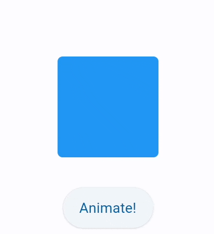
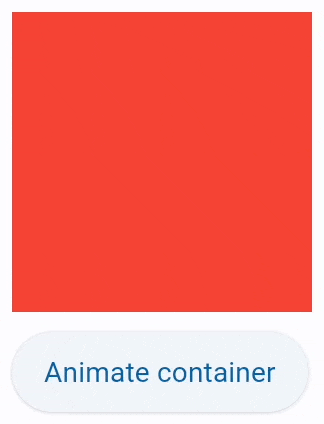

## Implicit animations

With implicit animations, you can animate a control property by setting a target value; whenever that target 
value changes, the control animates the property from the old value to the new one. Animation produces 
interpolated values between the old and the new value over the given *duration*. By default, the animation 
is *linearly* increasing the animation value, however, a *curve* can be applied to the animation which changes the 
value according to the provided curve. For example, `AnimationCurve.EASE_OUT_CUBIC` curve increases the animation value quickly at the
beginning of the animation and then slows down until the target value is reached:

<video controls>
  <source src="https://flutter.github.io/assets-for-api-docs/assets/animation/curve_ease_out_cubic.mp4"/>
</video>
/// caption
///

Each `ConstrainedControl` provides a number of `animate_{something}` properties, described below, to enable implicit 
animation of its appearance:

* `animate_opacity`
* `animate_rotation`
* `animate_scale`
* `animate_offset`
* `animate_position`
* `animate` (`Container`)

`animate_*` properties could have one of the following values:

* Instance of `Animation` class - allows configuring the duration (in milliseconds) and the curve of the 
* animation, for example `animate_rotation=Animation(duration=300, curve=AnimationCurve.BOUNCE_OUT)`. 
  See [this](https://api.flutter.dev/flutter/animation/Curves-class.html) Flutter docs on animation curves for possible values. Default is `linear`.
* `int` value - enables animation with specified duration in milliseconds and `linear` curve.
* `bool` value - enables animation with the duration of 1000 milliseconds and `linear` curve.

### Opacity animation

Setting control's `animate_opacity` to either `True`, number or an instance of `Animation` class (see above) 
enables implicit animation of [`ConstrainedControl.opacity`][flet.ConstrainedControl.opacity] property.

```python
import flet as ft

def main(page: ft.Page):
    c = ft.Container(
        width=150,
        height=150,
        bgcolor=ft.Colors.BLUE,
        border_radius=10,
        animate_opacity=300,
    )

    def animate_opacity(e):
        c.opacity = 0 if c.opacity == 1 else 1
        c.update()

    page.add(
        c,
        ft.ElevatedButton(
            content="Animate opacity",
            on_click=animate_opacity,
        ),
    )

ft.run(main)
```

{width="80%"}
/// caption
///

### Rotation animation

Setting control's `animate_rotation` to either `True`, number or an instance of `Animation` class (see above) 
enables implicit animation of [`ConstrainedControl.rotate`][flet.ConstrainedControl.rotate] property.

```python
from math import pi
import flet as ft

def main(page: ft.Page):
    c = ft.Container(
        width=100,
        height=70,
        bgcolor=ft.Colors.BLUE,
        border_radius=5,
        rotate=ft.transform.Rotate(0, alignment=ft.alignment.center),
        animate_rotation=ft.Animation(300, ft.AnimationCurve.BOUNCE_OUT),
    )

    def animate(e):
        c.rotate.angle += pi / 2
        page.update()

    page.vertical_alignment = ft.MainAxisAlignment.CENTER
    page.horizontal_alignment = ft.CrossAxisAlignment.CENTER
    page.spacing = 30
    page.add(
        c,
        ft.ElevatedButton("Animate!", on_click=animate),
    )

ft.run(main)
```

{width="80%"}
/// caption
///

### Scale animation

Setting control's `animate_scale` to either `True`, number or an instance of `Animation` class (see above) 
enables implicit animation of [`ConstrainedControl.scale`][flet.ConstrainedControl.scale] property.

```python
import flet as ft

def main(page: ft.Page):
    c = ft.Container(
        width=100,
        height=100,
        bgcolor=ft.Colors.BLUE,
        border_radius=5,
        scale=ft.transform.Scale(scale=1),
        animate_scale=ft.Animation(600, ft.AnimationCurve.BOUNCE_OUT),
    )

    def animate(e):
        c.scale = 2
        page.update()

    page.vertical_alignment = ft.MainAxisAlignment.CENTER
    page.horizontal_alignment = ft.CrossAxisAlignment.CENTER
    page.spacing = 30
    page.add(
        c,
        ft.ElevatedButton("Animate!", on_click=animate),
    )

ft.run(main)
```

{width="80%"}
/// caption
///

### Offset animation

Setting control's `animate_offset` to either `True`, number or an instance of `Animation` class (see above) 
enables implicit animation of [`ConstrainedControl.offset`][flet.ConstrainedControl.offset] property.

`offset` property is an instance of `Offset` class which specifies horizontal `x` and vertical `y` 
offset of a control scaled to control's size. For example, an offset `Offset(-0.25, 0)` will result in 
a horizontal translation of one quarter the width of the control.

Offset animation is used for various sliding effects:

```python
import flet as ft

def main(page: ft.Page):
    c = ft.Container(
        width=150,
        height=150,
        bgcolor=ft.Colors.BLUE,
        border_radius=10,
        offset=ft.transform.Offset(-2, 0),
        animate_offset=ft.Animation(1000),
    )

    def animate(e):
        c.offset = ft.transform.Offset(0, 0)
        c.update()

    page.add(
        c,
        ft.ElevatedButton("Reveal!", on_click=animate),
    )

ft.run(main)
```

{width="80%"}
/// caption
///

### Position animation

Setting control's `animate_position` to either `True`, number or an instance of `Animation` class 
(see above) enables implicit animation of the following `ConstrainedControl` properties: 
[`left`][flet.ConstrainedControl.left], [`right`][flet.ConstrainedControl.right], 
[`bottom`][flet.ConstrainedControl.bottom], [`top`][flet.ConstrainedControl.top].


/// admonition | Note
    type: note
Positioning is effective only if the control is a descendant of one of the following:

- [`Stack`][flet.Stack] control
- [`Page.overlay`][flet.Page.overlay] list
///

```python
import flet as ft

def main(page: ft.Page):
    c1 = ft.Container(width=50, height=50, bgcolor=ft.Colors.RED, animate_position=1000)

    c2 = ft.Container(
        width=50, height=50, bgcolor=ft.Colors.GREEN, top=60, left=0, animate_position=500
    )

    c3 = ft.Container(
        width=50, height=50, bgcolor=ft.Colors.BLUE, top=120, left=0, animate_position=1000
    )

    def animate_container(e):
        c1.top = 20
        c1.left = 200
        c2.top = 100
        c2.left = 40
        c3.top = 180
        c3.left = 100
        page.update()

    page.add(
        ft.Stack([c1, c2, c3], height=250),
        ft.ElevatedButton("Animate!", on_click=animate_container),
    )

ft.run(main)
```

{width="80%"}
/// caption
///

### Animate

Setting [`Container.animate`][flet.Container.animate] to either `True`, number or an 
instance of `Animation` class (see above) enables implicit animation of container properties such as size, 
background color, border style, gradient.

```python
import flet as ft

def main(page: ft.Page):
    c = ft.Container(
        width=150,
        height=150,
        bgcolor=ft.Colors.RED,
        animate=ft.Animation(1000, ft.AnimationCurve.BOUNCE_OUT),
    )

    def animate_container(e):
        c.width = 100 if c.width == 150 else 150
        c.height = 50 if c.height == 150 else 150
        c.bgcolor = ft.Colors.BLUE if c.bgcolor == ft.Colors.RED else ft.Colors.RED
        c.update()

    page.add(c, ft.ElevatedButton("Animate container", on_click=animate_container))

ft.run(main)
```

{width="80%"}
/// caption
///


### Animated content switcher

[`AnimatedSwitcher`][flet.AnimatedSwitcher] allows animated transition between a new control and 
the control previously set on the `AnimatedSwitcher` as a `content`.

```python
import time

import flet as ft

def main(page: ft.Page):
    i = ft.Image(src="https://picsum.photos/150/150", width=150, height=150)

    def animate(e):
        sw.content = ft.Image(
            src=f"https://picsum.photos/150/150?{time.time()}", width=150, height=150
        )
        page.update()

    sw = ft.AnimatedSwitcher(
        i,
        transition=ft.AnimatedSwitcherTransition.SCALE,
        duration=500,
        reverse_duration=500,
        switch_in_curve=ft.AnimationCurve.BOUNCE_OUT,
        switch_out_curve=ft.AnimationCurve.BOUNCE_IN,
    )

    page.add(
        sw,
        ft.ElevatedButton("Animate!", on_click=animate),
    )

ft.run(main)
```

{width="80%"}
/// caption
///

### Animation end callback

`ConstrainedControl` also has an [`on_animation_end`][flet.ConstrainedControl.on_animation_end] event handler, which is called
when an animation is complete. It can be used to chain multiple animations.

Event's `data` field/property contains the name of animation:

* `"opacity"`
* `"rotation"`
* `"scale"`
* `"offset"`
* `"position"`
* `"container"`

For example:

```python
ft.Container(
    content=ft.Text("Animate me!"),
    animate=ft.Animation(1000, ft.AnimationCurve.BOUNCE_OUT),
    on_animation_end=lambda e: print("Container animation end:", e.data)
)
```
