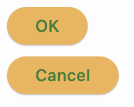
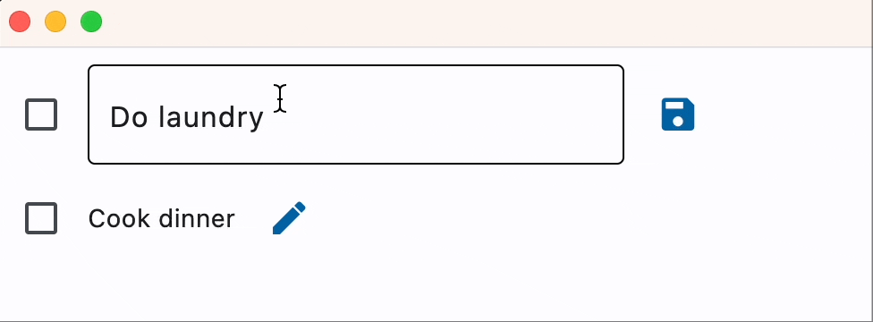

While Flet provides 100+ built-in controls that can be used on their own, the real beauty of programming with Flet is that all those controls can be utilized for creating your own reusable UI components using Python object-oriented programming concepts.

You can create custom controls in Python by styling and/or combining existing Flet controls.

## Styled controls

The most simple custom control you can create is a styled control, for example, a button of a certain color and behaviour that will be used multiple times throughout your app.

To create a styled control, you need to create a new class in Python that inherits from the Flet control you are going to customize, `Button` in this case:

```python
class MyButton(ft.Button):
    def __init__(self, text):
        super().__init__()
        self.bgcolor = ft.Colors.ORANGE_300
        self.color = ft.Colors.GREEN_800
        self.text = text
```
Your control has a constructor to customize properties and events and pass custom data. Note that you must call `super().__init__()` in your own constructor to have access to the properties and methods of the Flet control from which you inherit.

Now you can use your brand-new control in your app:

```python
import flet as ft

def main(page: ft.Page):
    page.add(MyButton(text="OK"), MyButton(text="Cancel"))

ft.run(main)
```


/// caption
///

See example of using styled controls in [Calculator App tutorial](../tutorials/calculator.md#styled-controls).

### Handling events

Similar to properties, you can pass event handlers as parameters into your custom control class constructor:

```python
import flet as ft

class MyButton(ft.Button):
    def __init__(self, text, on_click):
        super().__init__()
        self.bgcolor = ft.Colors.ORANGE_300
        self.color = ft.Colors.GREEN_800
        self.text = text
        self.on_click = on_click

def main(page: ft.Page):

    def ok_clicked(e):
        print("OK clicked")

    def cancel_clicked(e):
        print("Cancel clicked")

    page.add(
        MyButton(text="OK", on_click=ok_clicked),
        MyButton(text="Cancel", on_click=cancel_clicked),
    )

ft.run(main)
```

## Composite controls

Composite custom controls inherit from container controls such as `Column`, `Row`, `Stack` or even `View` to combine multiple Flet controls. The example below is a `Task` control that can be used in a To-Do app:

```python
import flet as ft

class Task(ft.Row):
    def __init__(self, text):
        super().__init__()
        self.text_view = ft.Text(text)
        self.text_edit = ft.TextField(text, visible=False)
        self.edit_button = ft.IconButton(icon=ft.Icons.EDIT, on_click=self.edit)
        self.save_button = ft.IconButton(
            visible=False, icon=ft.Icons.SAVE, on_click=self.save
        )
        self.controls = [
            ft.Checkbox(),
            self.text_view,
            self.text_edit,
            self.edit_button,
            self.save_button,
        ]

    def edit(self, e):
        self.edit_button.visible = False
        self.save_button.visible = True
        self.text_view.visible = False
        self.text_edit.visible = True
        self.update()

    def save(self, e):
        self.edit_button.visible = True
        self.save_button.visible = False
        self.text_view.visible = True
        self.text_edit.visible = False
        self.text_view.value = self.text_edit.value
        self.update()

def main(page: ft.Page):
    page.add(
        Task(text="Do laundry"),
        Task(text="Cook dinner"),
    )

ft.run(main)
```

{width="90%"}
/// caption
///

## Life-cycle methods

Custom controls provide life-cycle "hook" methods that you may need to use for different use cases in your app.

### `build()`

`build()` method is called when the control is being created and assigned its `self.page`.

Override `build()` method if you need to implement logic that cannot be executed in control's constructor because
it requires access to the `self.page`. For example, choose the right icon depending on `self.page.platform`
for your [adaptive app](adaptive-apps.md#custom-adaptive-controls).

### `did_mount()`

`did_mount()` method is called after the control is added to the page and assigned transient `uid`.

Override `did_mount()` method if you need to implement logic that needs to be executed after the control
was added to the page, for example [Weather widget](https://github.com/flet-dev/examples/tree/main/python/community/weather_widget)
which calls Open Weather API every minute to update itself with the new weather conditions.

### `will_unmount()`

`will_unmount()` method is called before the control is removed from the page.

Override `will_unmount()` method to execute clean-up code.

### `before_update()`

`before_update()` method is called every time when the control is being updated.

Make sure not to call `update()` method within `before_update()`.

## Isolated controls

Custom control has `is_isolated` property which defaults to `False`.

If you set `is_isolated` to `True`, your control will be isolated from outside layout, i.e. when `update()` method is called for the parent control, the control itself will be updated but any changes to the controls' children are not included into the update digest. Isolated controls should call `self.update()` to push its changes to a Flet page.

As a best practice, any custom control that calls `self.update()` inside its class methods should be isolated.

In the above examples, simple styled `MyButton` doesn't need to be isolated, but the `Task` should be:

```python
class Task(ft.Row):
    def __init__(self, text):
        super().__init__()

    def is_isolated(self):
        return True
```
