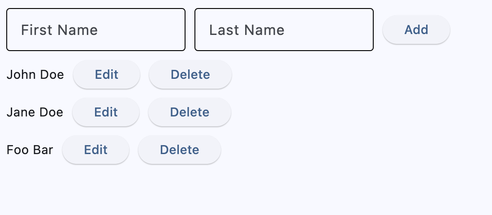
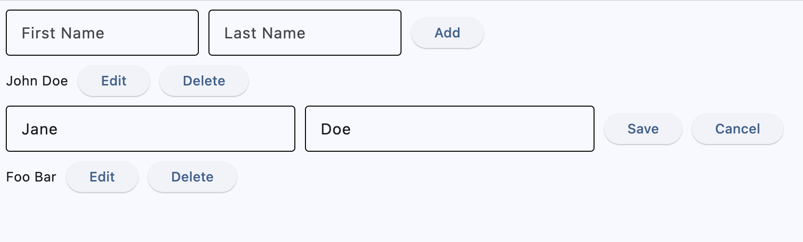
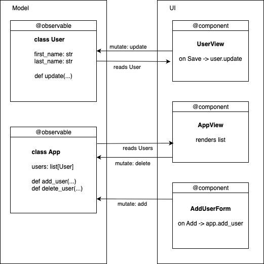

# From Imperative to Declarative in Flet: Migrating a Simple CRUD “User Manager”

If you’ve been using Flet, you’ve probably built your apps the imperative way, maybe without even noticing. You flip visibility flags, set control values, update lists of controls and call `page.update()` - that is the imperative approach, meaning you change UI directly when handling events. Flet now supports a declarative style: stop mutating controls, change state instead, and Flet updates the UI automatically.

We’ll show the switch using a tiny CRUD “User Manager” app. First, the imperative version: UI-first, mutate controls, then update the page. Then the declarative rewrite: model-first, observable classes for data, components that return UI from state.

The behavior in both examples stays the same - in the app you can see the list of users, add user, inline edit with save/cancel buttons and delete. This is how this simple app looks in boths examples:

{width="70%"}

After clicking inline Edit button:

{width="80%"}

## Example 1 — Imperative

In the imperative version, you think **UI-first**: decide exactly how the screen should look, and how it should change on each button click. Event handlers directly toggle control properties (like `visible`, `value`), insert/remove controls, and then call `page.update()` to push those visual changes. **Edit** hides the read-only label and action buttons, shows inputs and **Save/Cancel**; **Save** copies text field values back into the label and restores the original view; **Cancel** just restores the original view; **Delete** removes the whole row from the page. In short, behavior is implemented by **mutating controls** and **manually triggering re-renders**, not by evolving a separate state model.

```python
import flet as ft


class Item(ft.Row):
    def __init__(self, first_name, last_name):
        super().__init__()

        self.first_name_field = ft.TextField(first_name)
        self.last_name_field = ft.TextField(last_name)
        self.text = ft.Text(f"{first_name} {last_name}")
        self.edit_text = ft.Row(
            [
                self.first_name_field,
                self.last_name_field,
            ],
            visible=False,
        )
        self.edit_button = ft.Button("Edit", on_click=self.edit_item)
        self.delete_button = ft.Button("Delete", on_click=self.delete_item)
        self.save_button = ft.Button("Save", on_click=self.save_item, visible=False)
        self.cancel_button = ft.Button(
            "Cancel", on_click=self.cancel_item, visible=False
        )
        self.controls = [
            self.text,
            self.edit_text,
            self.edit_button,
            self.delete_button,
            self.save_button,
            self.cancel_button,
        ]

    def delete_item(self, e):
        self.page.controls.remove(self)
        self.page.update()

    def edit_item(self, e):
        print("edit_item")
        self.text.visible = False
        self.edit_button.visible = False
        self.delete_button.visible = False
        self.save_button.visible = True
        self.cancel_button.visible = True
        self.edit_text.visible = True
        self.page.update()

    def save_item(self, e):
        self.text.value = f"{self.first_name_field.value} {self.last_name_field.value}"
        self.text.visible = True
        self.edit_button.visible = True
        self.delete_button.visible = True
        self.save_button.visible = False
        self.cancel_button.visible = False
        self.edit_text.visible = False
        self.page.update()

    def cancel_item(self, e):
        self.text.visible = True
        self.edit_button.visible = True
        self.delete_button.visible = True
        self.save_button.visible = False
        self.cancel_button.visible = False
        self.edit_text.visible = False
        self.page.update()


def main(page: ft.Page):
    page.title = "CRUD Imperative Example"

    def add_item(e):
        item = Item(first_name.value, last_name=last_name.value)
        page.add(item)
        first_name.value = ""
        last_name.value = ""
        page.update()

    first_name = ft.TextField(label="First Name", width=200)
    last_name = ft.TextField(label="Last Name", width=200)

    page.add(
        ft.Row(
            [
                first_name,
                last_name,
                ft.Button("Add", on_click=add_item),
            ]
        )
    )


ft.run(main)
```

## Example 2 — Declarative

In the declarative version, you think **model-first**: the model is a set of classes, and the data their objects hold is the single source of truth. In our CRUD app, the model consists of `User` (persisted fields `first_name`, `last_name`) and a top-level `App` that owns `users: list[User]` plus actions like `add_user(first, last)` and `delete_user(user)`. Both classes are marked `@ft.observable`, so assigning to their attributes (e.g., `user.update(...)`, `app.users.remove(user)`) triggers re-rendering — no `page.update()`.

The UI is composed as components marked with `@ft.component` that return a view of the current state. Each row decides whether to show a read-only view or an inline editor using its own short-lived, local values (hooks), while the durable data lives on the model objects. Event handlers update state only (e.g., modify a user or add/remove items), not the controls themselves; Flet detects those changes and re-renders the affected parts. In short: **UI = f(state)**, with `User` and `App` providing the authoritative data.


{width="80%"}


```python
from dataclasses import dataclass, field

import flet as ft


@ft.observable
@dataclass
class User:
    first_name: str
    last_name: str

    def update(self, first_name: str, last_name: str):
        self.first_name = first_name
        self.last_name = last_name


@ft.observable
@dataclass
class App:
    users: list[User] = field(default_factory=list)

    def add_user(self, first_name: str, last_name: str):
        if first_name.strip() or last_name.strip():
            self.users.append(User(first_name, last_name))

    def delete_user(self, user: User):
        self.users.remove(user)


@ft.component
def UserView(user: User, delete_user) -> ft.Control:
    # Local (transient) editing state—NOT in User
    is_editing, set_is_editing = ft.use_state(False)
    new_first_name, set_new_first_name = ft.use_state(user.first_name)
    new_last_name, set_new_last_name = ft.use_state(user.last_name)

    def start_edit():
        set_new_first_name(user.first_name)
        set_new_last_name(user.last_name)
        set_is_editing(True)

    def save():
        user.update(new_first_name, new_last_name)
        set_is_editing(False)

    def cancel():
        set_is_editing(False)

    if not is_editing:
        return ft.Row(
            [
                ft.Text(f"{user.first_name} {user.last_name}"),
                ft.Button("Edit", on_click=start_edit),
                ft.Button("Delete", on_click=lambda: delete_user(user)),
            ]
        )

    return ft.Row(
        [
            ft.TextField(
                label="First Name",
                value=new_first_name,
                on_change=lambda e: set_new_first_name(e.control.value),
                width=180,
            ),
            ft.TextField(
                label="Last Name",
                value=new_last_name,
                on_change=lambda e: set_new_last_name(e.control.value),
                width=180,
            ),
            ft.Button("Save", on_click=save),
            ft.Button("Cancel", on_click=cancel),
        ]
    )


@ft.component
def AddUserForm(add_user) -> ft.Control:
    # Uses local buffers; calls parent action on Add
    new_first_name, set_new_first_name = ft.use_state("")
    new_last_name, set_new_last_name = ft.use_state("")

    def add_user_and_clear():
        add_user(new_first_name, new_last_name)
        set_new_first_name("")
        set_new_last_name("")

    return ft.Row(
        controls=[
            ft.TextField(
                label="First Name",
                width=200,
                value=new_first_name,
                on_change=lambda e: set_new_first_name(e.control.value),
            ),
            ft.TextField(
                label="Last Name",
                width=200,
                value=new_last_name,
                on_change=lambda e: set_new_last_name(e.control.value),
            ),
            ft.Button("Add", on_click=add_user_and_clear),
        ]
    )


@ft.component
def AppView() -> list[ft.Control]:
    app, _ = ft.use_state(
        App(
            users=[
                User("John", "Doe"),
                User("Jane", "Doe"),
                User("Foo", "Bar"),
            ]
        )
    )

    return [
        AddUserForm(app.add_user),
        *[UserView(user, app.delete_user) for user in app.users],
    ]


ft.run(lambda page: page.render(AppView))
```

---

## Mindset shift: UI = f(state)

The core idea is **determinism**: given the same state, your component should return the same UI. Think in two phases:

1. **Handle event → update state**
   Event handlers change *data only* (e.g., `set_is_editing(True)`, `user.update(...)`).
   They don’t hide/show controls or call `page.update()`.

2. **Render → derive UI from state**
   The component *returns* controls based on the current state snapshot.
   Because models are `@ft.observable` and locals come from `ft.use_state`, Flet re-runs the component when state changes and re-renders the right subtree.


## Declarative Building Blocks: Observables, Components, Hooks

Below are the key pieces of the Flet framework that make the declarative approach work:

### Observables — your source of truth

`@ft.observable` marks a dataclass as **reactive**. When you assign to its fields (`user.first_name = "Ada"` or `app.users.append(user)`), Flet re-renders any components that read those fields - no `page.update()` calls. Use observables for **persisted/domain data** (things you actually save).

```python
from dataclasses import dataclass, field
import flet as ft

@ft.observable
@dataclass
class User:
    first_name: str
    last_name: str

@ft.observable
@dataclass
class AppState:
    users: list[User] = field(default_factory=list)
```

### Components — functions that return UI

`@ft.component` turns a function into a **rendering unit**. It takes props (regular args), may use hooks, and **returns controls** that describe the UI for the current state. Components do **not** imperatively mutate the page tree; they just return what the UI *should* look like now.

```python
import flet as ft

@ft.component
def UserRow(user: User, on_delete) -> ft.Control:
    # returns a row for the current snapshot of `user`
    return ft.Row([
        ft.Text(f"{user.first_name} {user.last_name}"),
        ft.Button("Delete", on_click=lambda _: on_delete(user)),
    ])
```

### Hooks — local, short-lived UI state

Why they are needed: components are functions that **re-run on every render**. Plain local variables get reinitialized each time, and changing them doesn’t tell Flet to update the view. Hooks (e.g., `ft.use_state`) give a component a place to persist values across renders and a way to signal a re-render when those values change.

**What hooks solve**

* **Persistence:** locals reset on each render; hook state survives.
* **Reactivity:** modifying a local doesn’t refresh the UI; a hook’s setter schedules a re-render.
* **Fresh values in handlers:** event callbacks won’t see stale locals; they read the latest hook state.

**Use hooks for** short-lived, view-only concerns (like an “is editing?” flag or current input text) that belong to a single component.
**Use observables** for durable app/domain data shared across components.

**Example**

```python
# Broken: local resets every render and doesn't trigger updates
@ft.component
def CounterBroken():
    count = 0
    return ft.Row([
        ft.Text(str(count)),
        ft.Button("+", on_click=lambda _: (count := count + 1)),  # no re-render
    ])

# Correct: persists across renders and re-renders when updated
@ft.component
def Counter():
    count, set_count = ft.use_state(0)
    return ft.Row([
        ft.Text(str(count)),
        ft.Button("+", on_click=lambda _: set_count(count + 1)),
    ])
```

**Rule of thumb:** if a value must survive re-renders and updating it should change the UI, don’t use a plain local — use hook state (for local UI) or an observable (for shared, persisted data).


## Rewrite recipes (imperative → declarative)

### 1) Visibility toggles → Conditional rendering

```python
# Imperative
self.text.visible = False
self.save_button.visible = True
self.page.update()

# Declarative
return (
    ft.Row([...read-only...])
    if not is_editing
    else ft.Row([...edit form...])
)
```

### 2) Direct control mutation → Model mutation

```python
# Imperative
self.text.value = f"{first} {last}"

# Declarative
user.update(new_first_name, new_last_name)
```

### 3) `page.update()` everywhere → Nowhere

* Imperative handlers end with `page.update()`.
* Declarative code updates **observable fields** or **`use_state` values** and lets Flet re-render.

### 4) Handlers manipulate **state**, not the view

```python
# Declarative example
set_is_editing(True)
set_new_first_name(user.first_name)
```

### 5) Extract UI into components

* `UserView` = one row (read-only/editing)
* `AddUserForm` = small, reusable add form


## Summary

The declarative style makes your UI a straightforward function of your data. It may not be make a big diffrence for a very simple app, but as your screen grows, you’ll add **state** and **components**, not scattered mutations of controls in different places. The result: code that’s easier to understand, maintain, and change — without chasing `visible` flags or manual updates.
