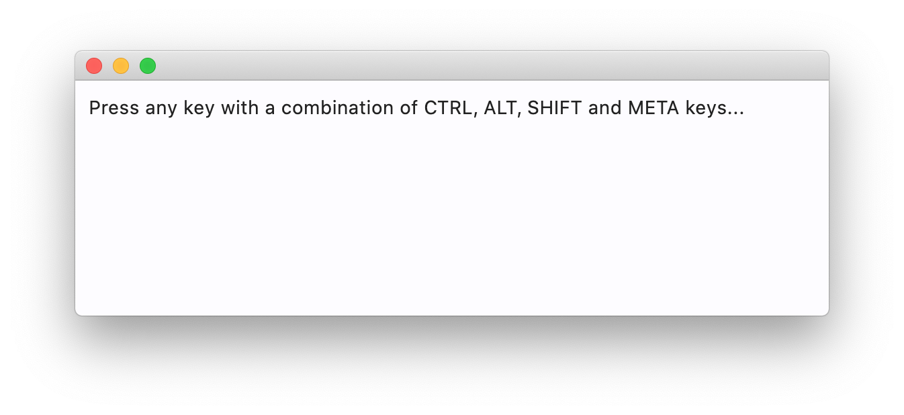

A solid keyboard support is a key for user productivity while using your web and, especially, desktop app. Indeed, it could be really annoying to constantly switch between mouse and keyboard.

In addition to form controls' `.autofocus` property and [`TextField.focus()`](/docs/controls/textfield#focus) method Flet allows handling "global" keyboard events.

To capture all keystrokes implement `page.on_keyboard_event` handler. Event handler parameter `e` is an instance of `KeyboardEvent` class with the following properties:

* `key` - a textual representation of a pressed key, e.g. `A`, `Enter` or `F5`.
* `shift` - `True` if "Shift" key is pressed.
* `ctrl` - `True` if "Control" key is pressed.
* `alt` - `True` if "Alt" ("Option") key is pressed.
* `meta` - `True` if "Command" key is pressed.

This is a simple usage example:

```python
import flet as ft

def main(page: ft.Page):
    def on_keyboard(e: ft.KeyboardEvent):
        page.add(
            ft.Text(
                f"Key: {e.key}, Shift: {e.shift}, Control: {e.ctrl}, Alt: {e.alt}, Meta: {e.meta}"
            )
        )

    page.on_keyboard_event = on_keyboard
    page.add(
        ft.Text("Press any key with a combination of CTRL, ALT, SHIFT and META keys...")
    )

ft.run(main)
```


Here is [more advanced example](https://github.com/flet-dev/examples/blob/main/python/controls/page/keyboard-events.py).
