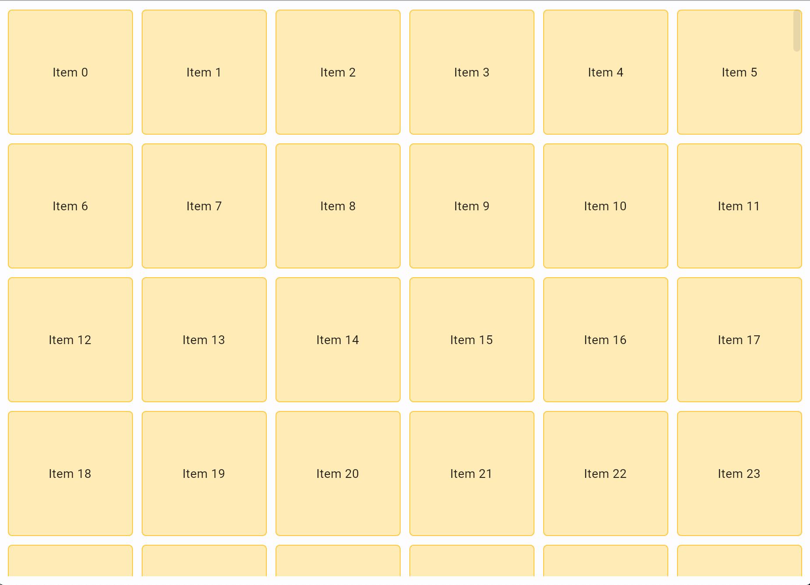

You can use [`Column`][flet.Column] and [`Row`][flet.Row] controls to display lists in the most cases, but if the list contains hundreds or thousands of items `Column` and `Row` will be ineffective with lagging UI as they render all items at once even they are not visible at the current scrolling position.

In the following example we are adding 5,000 text controls to a page. Page uses `Column` as a default layout container:

```python
import flet as ft

def main(page: ft.Page):
    for i in range(5000):
        page.controls.append(ft.Text(f"Line {i}"))
    page.scroll = "always"
    page.update()

ft.run(main, view=ft.AppView.WEB_BROWSER)
```

Run the program and notice that it's not just it takes a couple of seconds to initially load and render all text lines on a page, but scrolling is slow and laggy too:


For displaying lists with a lot of items use [`ListView`][flet.ListView] and [`GridView`][flet.GridView] controls which render items on demand, visible at the current scrolling position only.

## ListView

[`ListView`][flet.ListView] could be either vertical (default) or horizontal. ListView items are displayed one after another in the scroll direction.

ListView already implements effective on demand rendering of its children, but scrolling performance could be further improved if you can set the same fixed height or width (for `horizontal` ListView) for all items ("extent"). This could be done by either setting absolute extent with `item_extent` property or making the extent of all children equal to the extent of the first child by setting `first_item_prototype` to `True`.

Let's output a list of 5,000 items using ListView control:

```python
import flet as ft

def main(page: ft.Page):
    lv = ft.ListView(expand=True, spacing=10)
    for i in range(5000):
        lv.controls.append(ft.Text(f"Line {i}"))
    page.add(lv)

ft.run(main, view=ft.AppView.WEB_BROWSER)
```

Now the scrolling is smooth and fast enough to follow mouse movements:


/// admonition
    type: note
We used `expand=True` in ListView constructor. In order to function properly, ListView must have a height (or width if `horizontal`) specified. You could set an absolute size, e.g. `ListView(height=300, spacing=10)`, but in the example above we make ListView to take all available space on the page, i.e. expand. Read more about [`Control.expand`](/docs/controls#expand) property.
///

## GridView

[`GridView`][flet.GridView] allows arranging controls into a scrollable grid.

You can make a "grid" with `ft.Column(wrap=True)` or `ft.Row(wrap=True)`, for example:

```python
import os
import flet as ft

os.environ["FLET_WS_MAX_MESSAGE_SIZE"] = "8000000"

def main(page: ft.Page):
    r = ft.Row(wrap=True, scroll="always", expand=True)
    page.add(r)

    for i in range(5000):
        r.controls.append(
            ft.Container(
                ft.Text(f"Item {i}"),
                width=100,
                height=100,
                alignment=ft.alignment.center,
                bgcolor=ft.Colors.AMBER_100,
                border=ft.border.all(1, ft.Colors.AMBER_400),
                border_radius=ft.border_radius.all(5),
            )
        )
    page.update()

ft.run(main, view=ft.AppView.WEB_BROWSER)
```


Try scrolling and resizing the browser window - everything works, but very laggy.

/// admonition
    type: note
At the start of the program we are setting the value of `FLET_WS_MAX_MESSAGE_SIZE` environment variable to `8000000` - this is the maximum size of WebSocket message in bytes that can be received by Flet Server rendering the page. Default size is 1 MB, but the size of JSON message describing 5,000 container controls would exceed 1 MB, so we are increasing allowed size to 8 MB.

Squeezing large messages through WebSocket channel is, generally, not a good idea, so use [batched updates](#batch-updates) approach to control channel load.
///

GridView, similar to ListView, is very effective to render a lot of children. Let's implement the example above using GridView:

```python
import os
import flet as ft

os.environ["FLET_WS_MAX_MESSAGE_SIZE"] = "8000000"

def main(page: ft.Page):
    gv = ft.GridView(expand=True, max_extent=150, child_aspect_ratio=1)
    page.add(gv)

    for i in range(5000):
        gv.controls.append(
            ft.Container(
                ft.Text(f"Item {i}"),
                alignment=ft.alignment.center,
                bgcolor=ft.Colors.AMBER_100,
                border=ft.border.all(1, ft.Colors.AMBER_400),
                border_radius=ft.border_radius.all(5),
            )
        )
    page.update()

ft.run(main, view=ft.AppView.WEB_BROWSER)
```



With GridView scrolling and window resizing are smooth and responsive!

You can specify either fixed number of rows or columns (runs) with `runs_count` property or the maximum size of a "tile" with `max_extent` property, so the number of runs can vary automatically. In our example we set the maximum tile size to 150 pixels and set its shape to "square" with `child_aspect_ratio=1`. `child_aspect_ratio` is the ratio of the cross-axis to the main-axis extent of each child. Try changing it to `0.5` or `2`.

## Batch updates

When `page.update()` is called a message is being sent to Flet server over WebSockets containing page updates since the last `page.update()`. Sending a large message with thousands of added controls could make a user waiting for a few seconds until the messages is fully received and controls rendered.

To increase usability of your program and present the results to a user as soon as possible you can send page updates in batches. For example, the following program adds 5,100 child controls to a ListView in batches of 500 items:

```python
import flet as ft

def main(page: ft.Page):

    # add ListView to a page first
    lv = ft.ListView(expand=1, spacing=10, item_extent=50)
    page.add(lv)

    for i in range(5100):
        lv.controls.append(ft.Text(f"Line {i}"))
        # send page to a page
        if i % 500 == 0:
            page.update()
    # send the rest to a page
    page.update()

ft.run(main, view=ft.AppView.WEB_BROWSER)
```

