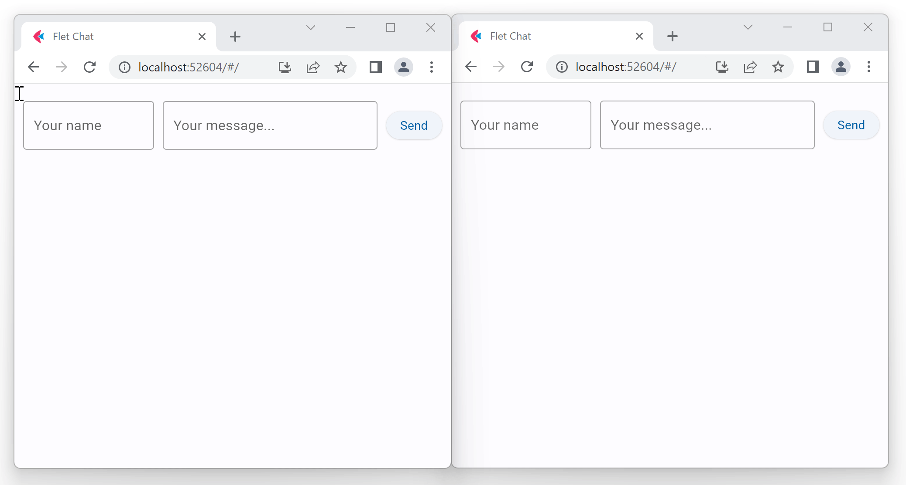

If you build a chat app using Flet you need somehow to pass user messages between sessions. When a user sends a message it should be broadcasted to all other app sessions and displayed on their pages.

Flet provides a simple built-in PubSub mechanism for asynchronous communication between page sessions.

Flet PubSub allows broadcasting messages to all app sessions or sending only to specific "topic" (or "channel") subscribers.

A typical PubSub usage would be:

* [subscribe][flet.Page.subscribe] to broadcast messages or [subscribe to a topic][flet.Page.subscribe_topic] on app session start.
* [send][flet.Page.send_all] broadcast message or [send to a topic][flet.Page.send_all_on_topic] on some event, like "Send" button click.
* [unsubscribe][flet.Page.subscribe] from broadcast messages or [unsubscribe from a topic][flet.Page.unsubscribe_topic] on some event, like "Leave" button click.
* [unsubscribe_all][flet.Page.unsubscribe_all] from everything on [`page.on_close`][flet.Page.on_close].

This is an example of a simple chat application:

```python
import flet as ft

def main(page: ft.Page):
    page.title = "Flet Chat"

    # subscribe to broadcast messages
    def on_message(msg):
        messages.controls.append(ft.Text(msg))
        page.update()

    page.pubsub.subscribe(on_message)

    def send_click(e):
        page.pubsub.send_all(f"{user.value}: {message.value}")
        # clean up the form
        message.value = ""
        page.update()

    messages = ft.Column()
    user = ft.TextField(hint_text="Your name", width=150)
    message = ft.TextField(hint_text="Your message...", expand=True)  # fill all the space
    send = ft.ElevatedButton("Send", on_click=send_click)
    page.add(messages, ft.Row(controls=[user, message, send]))

ft.run(main, view=ft.AppView.WEB_BROWSER)
```


/// caption
///
