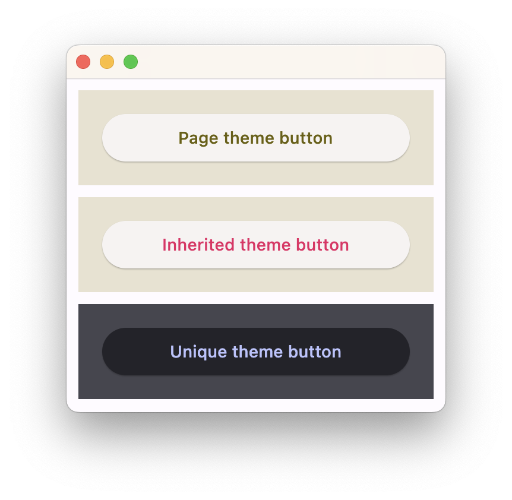

It is possible to configure your application and/or the containing controls to follow a particular themes.

### App-wide themes

The [`Page`][flet.Page] control (uppermost control in the tree) has two useful properties for this: [`theme`][flet.Page.theme]
and [`dark_theme`][flet.Page.dark_theme] properties to configure the appearance/theme of the entire app in light and
dark theme modes respectively.

Both of type [`Theme`][flet.Theme], they represent the default/fallback themes to be used app-wide,
except explicitly modified/overriden in the tree.

```python
page.theme = ft.Theme(color_scheme_seed=ft.Colors.GREEN)
page.dark_theme = ft.Theme(color_scheme_seed=ft.Colors.BLUE)
```

### Nested themes

You can have a part of your app to use a different theme or override some theme styles for specific controls.

Some container-like controls have `theme` and `theme_mode` properties of type
[`Theme`][flet.Theme] and [`ThemeMode`][flet.ThemeMode] respectively.

Specifying `theme_mode` in the `Container` means you don't want to inherit parent theme mode,
but want a completely new, unique scheme for all controls inside the container.
However, if the container does not have `theme_mode` property set then the styles from its theme property
will override the ones from the parent inherited theme:

```python
import flet as ft

def main(page: ft.Page):
    # Yellow page theme with SYSTEM (default) mode
    page.theme = ft.Theme(
        color_scheme_seed=ft.Colors.YELLOW,
    )

    page.add(
        # Page theme
        ft.Container(
            content=ft.ElevatedButton("Page theme button"),
            bgcolor=ft.Colors.SURFACE_CONTAINER_HIGHEST,
            padding=20,
            width=300,
        ),

        # Inherited theme with primary color overridden
        ft.Container(
            theme=ft.Theme(color_scheme=ft.ColorScheme(primary=ft.Colors.PINK)),
            content=ft.ElevatedButton("Inherited theme button"),
            bgcolor=ft.Colors.SURFACE_CONTAINER_HIGHEST,
            padding=20,
            width=300,
        ),

        # Unique always DARK theme
        ft.Container(
            theme=ft.Theme(color_scheme_seed=ft.Colors.INDIGO),
            theme_mode=ft.ThemeMode.DARK,
            content=ft.ElevatedButton("Unique theme button"),
            bgcolor=ft.Colors.SURFACE_CONTAINER_HIGHEST,
            padding=20,
            width=300,
        ),
    )

ft.run(main)
```


