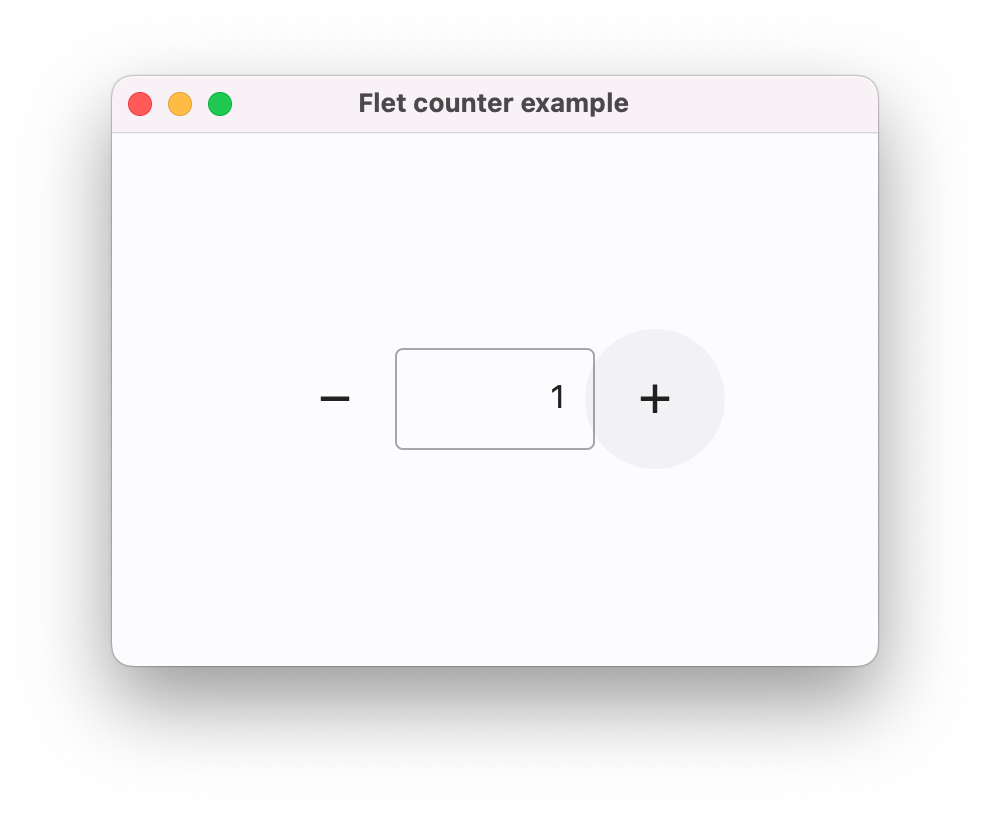
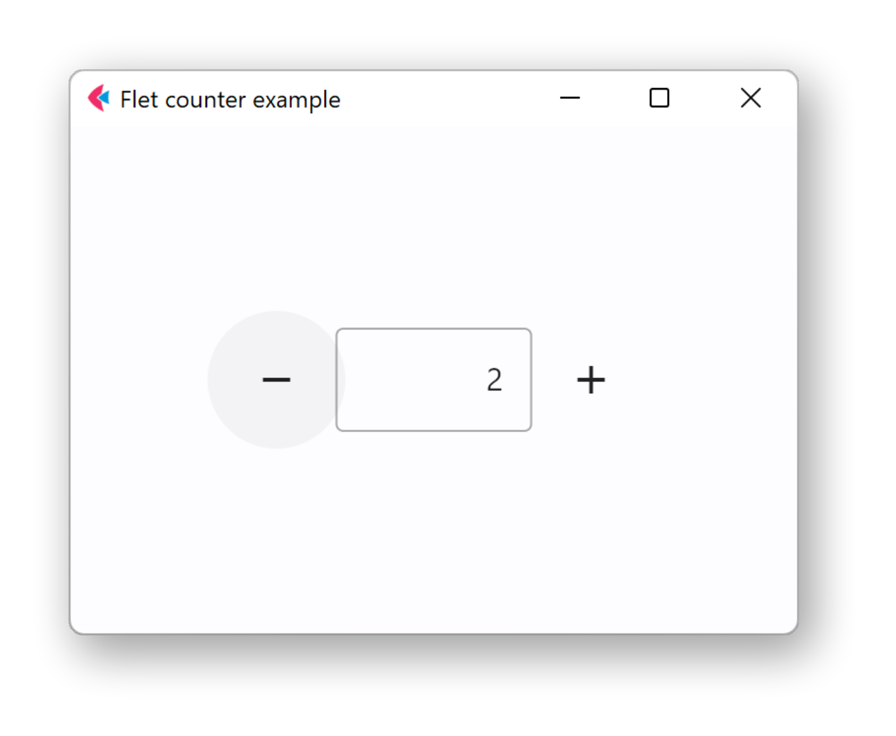
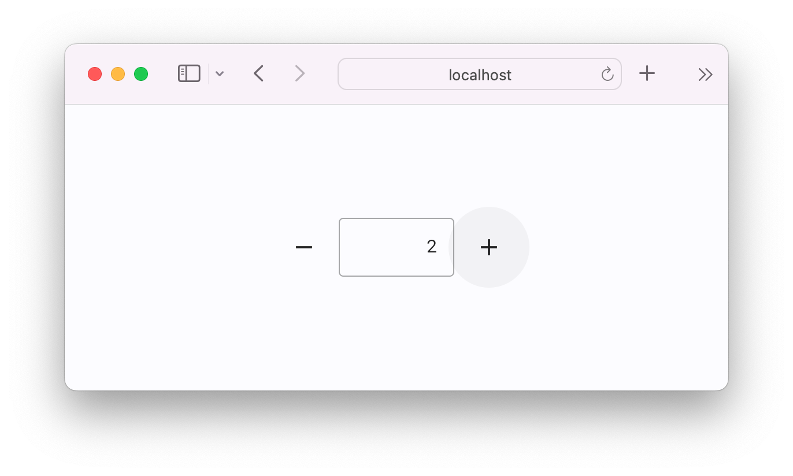

# Flet

[](https://pypi.python.org/pypi/flet)
[](https://pepy.tech/project/flet)
[](https://github.com/flet-dev/flet/blob/main/LICENSE)


Flet is a framework that allows building web, desktop and mobile applications in Python without prior experience in frontend development.

You can build a UI for your program with Flet [controls](controls/index.md) which are based on [Flutter](https://flutter.dev) by Google. Flet goes beyond merely wrapping Flutter widgets. It adds its own touch by combining smaller widgets, simplifying complexities, implementing UI best practices, and applying sensible defaults. This ensures that your applications look stylish and polished without requiring additional design efforts on your part.

## Usage

### Installation

Follow [these instructions](getting-started/installation.md) to install Flet and
get started based on your operating system.

### Example

The following is a simple counter app that demonstrates how to use Flet to create a user interface with buttons and text fields.

```python title="counter.py"
import flet as ft

def main(page: ft.Page):
    page.title = "Flet counter example"
    page.vertical_alignment = ft.MainAxisAlignment.CENTER

    field = ft.TextField(value="0", text_align=ft.TextAlign.RIGHT, width=100)

    def minus_click(e):
        field.value = str(int(field.value) - 1)
        page.update()

    def plus_click(e):
        field.value = str(int(field.value) + 1)
        page.update()

    page.add(
        ft.Row(
            alignment=ft.MainAxisAlignment.CENTER,
            controls=[
                ft.IconButton(ft.Icons.REMOVE, on_click=minus_click),
                field,
                ft.IconButton(ft.Icons.ADD, on_click=plus_click),
            ],
        )
    )

ft.run(main)
```

To get started, read ([this guide](getting-started/create-flet-app.md)).

/// tab | uv
```bash
uv run flet run counter.py
```
///
/// tab | pip
```bash
flet run counter.py
```
///
/// tab | poetry
```bash
poetry run flet run counter.py
```
///

The app will be started in a native OS window - what a nice alternative to Electron!

{ width="500px"}
/// caption
macOS
///

{ width="500px"}
/// caption
Windows
///

If you want to run the app in a web browser, you can use the `--web` (or `-w`) cli flag:

/// tab | uv
```bash
uv run flet run --web counter.py
```
///
/// tab | pip
```bash
flet run --web counter.py
```
///
/// tab | poetry
```bash
poetry run flet run --web counter.py
```
///

{ width="500px"}
/// caption
Web app
///
