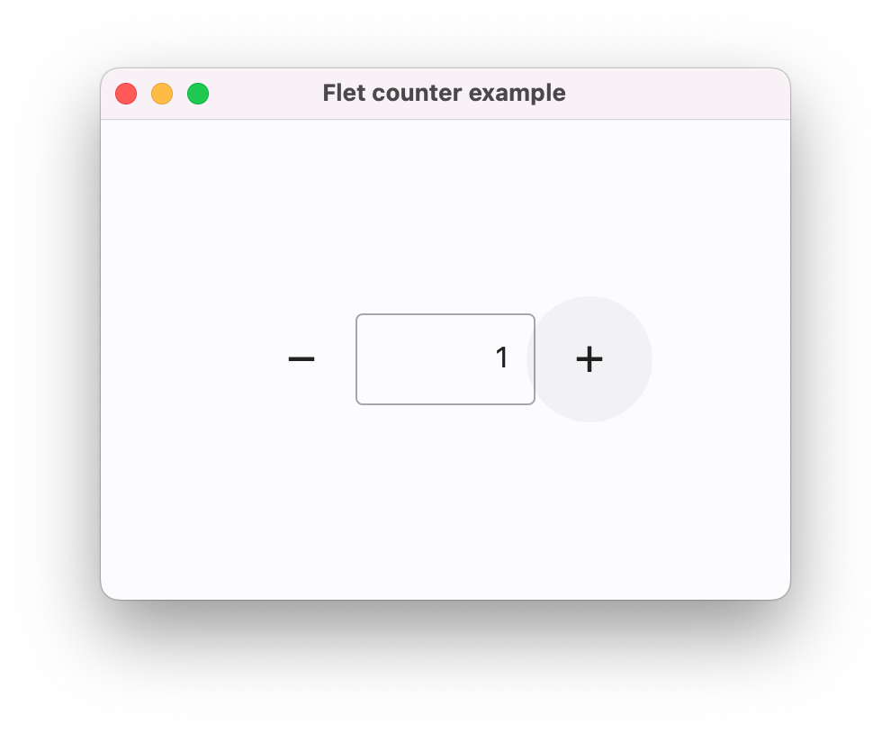
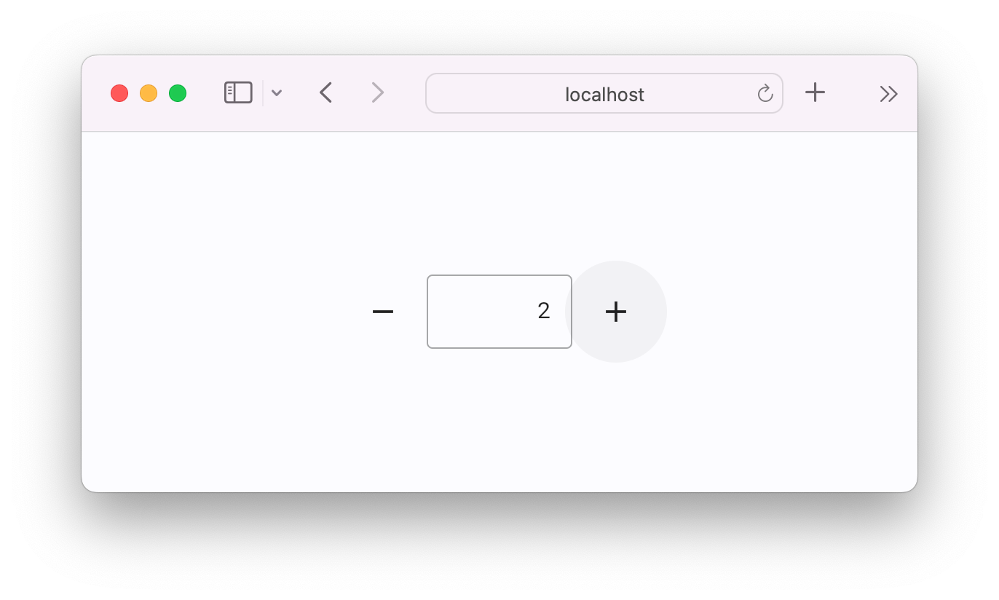

Flet is a framework that allows building web, desktop and mobile applications in Python without prior experience in frontend development.

## Flet app example

Below is a simple "Counter" app, with a text field and two buttons to increment and decrement the counter value:

```python title="counter.py"
import flet as ft

def main(page: ft.Page):
    page.title = "Flet counter example"
    page.vertical_alignment = ft.MainAxisAlignment.CENTER

    input = ft.TextField(value="0", text_align=ft.TextAlign.RIGHT, width=100)

    def minus_click(e):
        input.value = str(int(input.value) - 1)

    def plus_click(e):
        input.value = str(int(input.value) + 1)

    page.add(
        ft.Row(
            alignment=ft.MainAxisAlignment.CENTER,
            controls=[
                ft.IconButton(ft.Icons.REMOVE, on_click=minus_click),
                input,
                ft.IconButton(ft.Icons.ADD, on_click=plus_click),
            ],
        )
    )

ft.run(main)
```

To run the app, [install `flet`](getting-started/installation.md):

```bash
pip install 'flet[all]'
```

then launch the app:

```bash
flet run counter.py
```

This will open the app in a native OS window - what a nice alternative to Electron! 🙂

<p align="center">
    
</p>

To run the same app as a web app use `--web` option with `flet run` command:

```bash
flet run --web counter.py
```

<p align="center">
    
</p>
