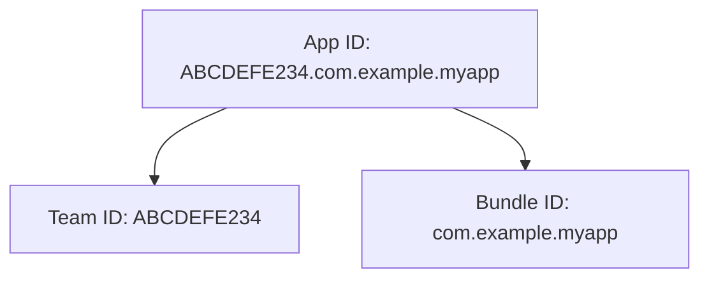

Instructions for packaging a Flet app into an Xcode archive and, when signing
is configured, an IPA for distribution.

/// admonition | Info
    type: tip
This guide provides detailed on iOS-specific information.
Complementary and more general information is available [here](index.md).
///

## Prerequisites

### Rosetta 2

Some Flutter tooling and dependencies still ship as Intel binaries. Install
[Rosetta 2](https://support.apple.com/en-us/HT211861) on Apple Silicon if Flutter
or CocoaPods prompts for it:

```bash
sudo softwareupdate --install-rosetta --agree-to-license
```

### Xcode

[Xcode](https://developer.apple.com/xcode/) 15 or later to compile native Swift or Objective-C code.
Open Xcode once after installation to accept the license and install additional components.

### CocoaPods

[CocoaPods](https://cocoapods.org/) 1.16 or later to compile and enable Flutter plugins.

### iOS wheels for binary Python packages

Binary Python packages (vs "pure" Python packages written in Python only)
are packages that are partially written in C, Rust, or other languages producing native code.
Example packages are `numpy`, `cryptography`, or `pydantic-core`.

Make sure all non-pure (binary) packages used in your Flet app have
[pre-built wheels for iOS](../reference/binary-packages-android-ios.md).

## `flet build ipa`

/// admonition | Supported host platforms
    type: caution
This command can be run on **macOS only**.
///

Builds an iOS app archive (`.xcarchive`) and, when signing is configured,
exports an `.ipa` for testing or distribution.

To generate an `.ipa` for testing on your device or uploading to App Store Connect
for distribution, you will need the following:

- [Apple Developer Program](https://developer.apple.com/programs/) subscription with
  access to [App Store Connect](https://appstoreconnect.apple.com/)
- [Application Identifier](#application-identifier-app-id)
- [Bundle ID](index.md#bundle-id) configured in your Flet project (must match the App ID)
- [Signing Certificate](#signing-certificate)
- [Provisioning Profile](#provisioning-profile)

Build outputs are copied into the [output directory](index.md#output-directory):

## Application Identifier (App ID)

A unique string that identifies your app within the Apple ecosystem.
It is required to sign and distribute an iOS app and is used for various services like
Push Notifications, App Groups, iCloud, and In-App Purchases.

It consists of two parts:

1. [**Team ID**](#team-id): A unique 10-character string assigned by Apple to your developer account.
2. [**Bundle ID**](index.md#bundle-id): A reverse domain-style identifier for your app (e.g., `com.example.myapp`).



The [Bundle ID](index.md#bundle-id) in your Flet configuration must match the Bundle ID registered
in the App ID.

### Creating a new App ID

1. Visit [Apple Developer Portal](https://developer.apple.com/account/resources/identifiers/list).
2. Sign in with your **Apple Developer Account**.
3. Click the **"+"** button to add a new identifier.
4. Select **"App IDs"** and click **Continue**.
5. **Enter a Description** – This is just for reference (e.g., "MyApp Identifier").
6. **Choose the App ID Type:**
    - Select **"App"** for a standard iOS/macOS app.
    - If you need an identifier for services like Apple Pay or Passbook, select the appropriate option.
7. **Bundle ID** – Choose:
    - **Explicit Bundle ID** (`com.example.myapp`) – Recommended for most apps.
    - **Wildcard Bundle ID** (`com.example.*`) – Allows multiple apps to use the same identifier (rarely used).
8. **Enable App Services** – Check the boxes for any services your app needs (e.g., Push Notifications, Sign in with Apple, etc.).
9. Click **Continue** and **Register**.

Now you have **Bundle ID** and **Team ID** that will be used to identify your app.

### Team ID

The developer team ID to include in export options.

#### Resolution order

Its value is determined in the following order of precedence:

1. [`--ios-team-id`](../cli/flet-build.md#-ios-team-id)
2. `[tool.flet.ios].team_id`
3. `[tool.flet.ios.export_methods."EXPORT_METHOD"].team_id`

#### Example

/// tab | `flet build`
```bash
flet build ipa --ios-team-id ABCDEFE234
```
///
/// tab | `pyproject.toml`
```toml
[tool.flet.ios]
team_id = "ABCDEFE234"
```
///

## Signing Certificate

The certificate name, SHA-1 hash, or automatic selector to use for signing the iOS app bundle.
Automatic selectors allow Xcode to pick the newest installed certificate of a particular type.

The available automatic selectors are:

- `"Apple Development"`
- `"Apple Distribution"`
- `"Developer ID Application"`
- `"iOS Developer"`
- `"iOS Distribution"`
- `"Mac App Distribution"`
- `"Mac Developer"`

### Generating a Certificate Signing Request (CSR)

Before creating a development or distribution certificate, you need a **CSR (Certificate Signing Request)**.

1. **Open Keychain Access** on your Mac (++cmd+space++, then search for "Keychain Access").
2. In the top menu, go to **Keychain Access → Certificate Assistant → Request a Certificate From a Certificate Authority…**
3. Fill in:
   - **User Email Address:** Your Apple Developer email.
   - **Common Name:** A descriptive name (e.g., "My App Distribution").
   - **CA Email Address:** Leave this blank.
   - **Request is for:** Select "**Saved to disk**".
4. Click **Continue**, choose a location to save the `.certSigningRequest` file, and click **Save**.

### Creating a Certificate in Apple Developer Portal

1. Go to the [Apple Developer Certificates Page](https://developer.apple.com/account/resources/certificates/list).
2. Click the **"+"** button to create a new certificate.
3. Select **"Apple Distribution"** (for App Store & Ad Hoc) or **"Apple Development"**
   (for development) and click **Continue**.
4. Upload the **CSR file** you created earlier and click **Continue**.
5. Apple will generate the certificate. Click **Download** to get the `.cer` file.
6. Double-click the downloaded `.cer` file to install it in **Keychain Access**.
7. Open the **Keychain Access** app and ensure the certificate is installed under **"login"** keychain.
   The name of the development certificate usually starts with **"Apple development:"** and the name of
    the distribution certificate starts with **"Apple distribution:"**.

### Resolution order

Its value is determined in the following order of precedence:

1. [`--ios-signing-certificate`](../cli/flet-build.md#-ios-signing-certificate)
2. `[tool.flet.ios].signing_certificate`
3. `[tool.flet.ios.export_methods."EXPORT_METHOD"].signing_certificate`

#### Example

/// tab | `flet build`
```bash
flet build ipa --ios-signing-certificate "Apple Distribution"
```
///
/// tab | `pyproject.toml`
```toml
[tool.flet.ios]
signing_certificate = "Apple Distribution"
```
///

## Provisioning Profile

A **Provisioning Profile** is a file that allows an iOS app to run on physical devices and be
distributed through the App Store or internally. It links your **App ID**,
**Developer/Distribution Certificate**, and **Registered Devices**.

There are different types of provisioning profiles:

1. **Development Profile** – Used for testing on physical devices.
2. **Ad Hoc Profile** – Used for distributing an app outside the App Store to specific devices.
3. **App Store Profile** – Used for submitting an app to the App Store.
4. **Enterprise Profile** – Used for internal distribution within an organization.

### Creating a New Provisioning Profile

Follow these steps to create a provisioning profile via the Apple Developer Portal:

#### Step 1: Go to Apple Developer Portal

- Visit the [Apple Developer Portal](https://developer.apple.com/account/resources/profiles/list);
- Sign in with your **Apple Developer Account**

#### Step 2: Create a New Provisioning Profile

- Click the **"+"** button to add a new provisioning profile;
- Choose the **type of profile**:
    - **iOS App Development** – for testing on devices
    - **Ad Hoc** – for distributing to specific devices
    - **App Store** – for submitting an app to the App Store
    - **In-House** – for internal distribution (Enterprise accounts only)
- Click **Continue**

#### Step 3: Select an App ID

- Choose the **App ID** that matches your app;
- Click **Continue**.

#### Step 4: Select a Distribution Certificate

- Choose the appropriate certificate:
    - **iOS Development Certificate** - for **iOS App Development** profile
    - **iOS Distribution Certificate** - for **Ad Hoc** or **App Store** profiles
- Click **Continue**.

#### Step 5: Select Registered Devices (for Development & Ad Hoc)

- If you selected an **iOS App Development** or **Ad Hoc** profile, select the devices to include;
- Click **Continue**.

#### Step 6: Name and Generate the Profile

- Enter a **Profile Name** (e.g., `MyApp Development Profile`);
- Click **Generate**;
- Click **Download** to get the `.mobileprovision` file.

### Installing Provisioning Profile

Provisioning profiles are stored in `~/Library/MobileDevice/Provisioning Profiles` directory.

To install a downloaded provisioning profile, copy it to `~/Library/MobileDevice/Provisioning\ Profiles`
directory with a new `{UUID}.mobileprovision` name.

Run the following command to get profile UUID:

```bash
profile_uuid=$(security cms -D -i ~/Downloads/{profile-name}.mobileprovision | xmllint --xpath "string(//key[.='UUID']/following-sibling::string[1])" -)
echo $profile_uuid
```

Run this command to copy profile to `~/Library/MobileDevice/Provisioning Profiles` with a new name `{UUID}.mobileprovision`:

```bash
cp ~/Downloads/{profile-name}.mobileprovision ~/Library/MobileDevice/Provisioning\ Profiles/${profile_uuid}.mobileprovision
```

/// admonition | Note
If the copied profile disappears from the `~/Library/MobileDevice/Provisioning Profiles` directory,
ensure that the Xcode process is not running in the background.
///

Finally, you can use the command below to list all installed provisioning profiles, with their names and UUIDs:

```bash
for profile in ~/Library/MobileDevice/Provisioning\ Profiles/*.mobileprovision; do security cms -D -i "$profile" | grep -E -A1 '<key>(Name|UUID)</key>' | sed -n 's/.*<string>\(.*\)<\/string>/\1/p' | paste -d ' | ' - -; done
```

### Resolution order

Its value is determined in the following order of precedence:

1. [`--ios-provisioning-profile`](../cli/flet-build.md#-ios-provisioning-profile)
2. `[tool.flet.ios].provisioning_profile`
3. `[tool.flet.ios.export_methods."EXPORT_METHOD"].provisioning_profile`

The profile must match your [Bundle ID](index.md#bundle-id).

#### Example

/// tab | `flet build`
```bash
flet build ipa --ios-provisioning-profile "release-testing com.mycompany.example-app"
```
///
/// tab | `pyproject.toml`
```toml
[tool.flet.ios]
provisioning_profile = "release-testing com.mycompany.example-app"
```
///

## Export configuration

### Export options

Additional keys to include in the generated `exportOptions.plist`
of the [build template](index.md#build-template).

For a complete list of supported keys and values, run the following command:

```bash
xcodebuild -help
```

and find the section titled **"Available keys for -exportOptionsPlist"**.

#### Resolution order

Its value is determined in the following order of precedence:

1. `[tool.flet.ios].export_options` (if set, per-method export options are ignored)
2. `[tool.flet.ios.export_methods."EXPORT_METHOD"].export_options` (see [export methods](#export-methods))
3. `{}` (no extra keys)

#### Example

/// tab | `pyproject.toml`
```toml
[tool.flet.ios]
export_options = { uploadSymbols = false }
```
///

### Export method

Defines how the app should be packaged when exporting the `.ipa` file.

Can be one of the following:

- `debugging` (or deprecated `development`): used for debugging and testing on development devices.
- `release-testing` (or deprecated `ad-hoc`): used for distributing the app outside the App Store to specific registered devices.
- `app-store-connect` (or deprecated `app-store`): used for submitting the app to the App Store.
- `enterprise`: used for internal distribution within an organization (requires an enterprise account).

To configure individual settings for one or more export methods, see [export methods](#export-methods).

#### Resolution order

Its value is determined in the following order of precedence:

1. [`--ios-export-method`](../cli/flet-build.md#-ios-export-method)
2. `[tool.flet.ios].export_method`
3. `"debugging"`

#### Example

/// tab | `flet build`
```bash
flet build ipa --ios-export-method debugging
```
///
/// tab | `pyproject.toml`
```toml
[tool.flet.ios]
export_method = "debugging"
```
///

### Export methods

Signing settings can be configured individually per [export method](#export-method).

Per-method values are used only when the corresponding top-level
`[tool.flet.ios]` setting is not set. The method key must match the `export_method` value exactly.

Supported keys (same as the top-level settings):

- [`provisioning_profile`](#provisioning-profile)
- [`signing_certificate`](#signing-certificate)
- [`export_options`](#export-options)
- [`team_id`](#team-id)

#### Example

/// tab | `pyproject.toml`
```toml
[tool.flet.ios.export_methods."debugging"]
provisioning_profile = "debugging com.mycompany.example-app"
signing_certificate = "Apple Development"

[tool.flet.ios.export_methods."release-testing"]
provisioning_profile = "release-testing com.mycompany.example-app"
team_id = "ABCDEFE234"
signing_certificate = "Apple Distribution"
export_options = { uploadSymbols = false }

[tool.flet.ios.export_methods."app-store-connect"]
provisioning_profile = "app-store-connect com.mycompany.example-app"
team_id = "ABCDEFE234"
signing_certificate = "Apple Distribution"
export_options = { uploadSymbols = true }
```
///

## Permissions

iOS permissions are declared through [`Info.plist`](#infoplist) privacy usage strings.
You can also use the [cross-platform permission bundles](index.md#predefined-cross-platform-permission-bundles)
to inject common entries, then override or extend them with platform-specific values.

### Info.plist

Add or override `Info.plist` entries for macOS builds.
These values are written to `ios/Runner/Info.plist` of the [build project](index.md#build-template).

#### Resolution order

Its value is determined in the following order of precedence:

1. [`--info-plist`](../cli/flet-build.md#-info-plist)
2. `[tool.flet.ios.info]`

#### Example

/// tab | `flet build`
```bash
flet build ipa --info-plist NSLocationWhenInUseUsageDescription="This app uses location service when in use."
```
///
/// tab | `pyproject.toml`
```toml
[tool.flet.ios.info]
NSCameraUsageDescription = "This app uses the camera to ..."
```
///

## Deploying an App to an Apple Device for Testing

You can deploy `.ipa` files directly to an iPhone or iPad on macOS—ideal for
internal testing without publishing to the App Store.

Follow these steps:

#### Install and Launch Apple Configurator

- Install [Apple Configurator](https://apps.apple.com/ca/app/apple-configurator/id1037126344?mt=12) from App Store;
- Find and open it from your Applications folder.

#### Connect Your iOS Device

- Connect your device (iPhone or iPad) to your Mac via USB;
- Unlock the connected device, and tap **Trust This Computer**, if prompted;
- Wait for this device to appear in the Apple Configurator.

#### Add the `.ipa` File

- Either drag the `.ipa` file onto the connected device in Apple Configurator;
- Or click **Add → Apps**, then browse and select the `.ipa` file from your Mac.

#### Install the App

- Click **Prepare** or **Install** to begin the deployment/installation;
- Apple Configurator will install the app on the connected device.

#### Trust the Developer (for Ad Hoc or Enterprise apps)

If your app is signed with an **Ad Hoc** or **Enterprise** [provisioning profile](#provisioning-profile),
you'll need to manually trust the developer:

- On the iOS device, go to **Settings → General → VPN & Device Management**;
- Under **Developer App**, tap your **Developer Profile**;
- Tap **Trust [Your Developer Name]**, then confirm.

## Uploading app to App Store Connect for distribution

#### Install and Sign in to Transporter

- Install and open [**Transporter**](https://apps.apple.com/us/app/transporter/id1450874784) from the Mac App Store.
- Sign in using your **Apple Developer Account** credentials (the same account used for App Store Connect).

#### Prepare Your `.ipa` File

- Build your app and export an `.ipa` file using the **app-store-connect** export method.
  (**release-testing** is for Ad Hoc device distribution, not App Store Connect.)

#### Upload the `.ipa` File in Transporter

- Drag and drop the `.ipa` file directly into the Transporter window, or click "Add App" and select your `.ipa` file from your Mac.
- Click the "..." button next to "Deliver", and select "Verify".
- Wait for Transporter to complete the verification process.
- After successful verification, click "Deliver" to upload your `.ipa` file to App Store Connect.

#### Check Upload Status

- Transporter will display a success message upon completion.
- If errors occur, carefully review the details provided, correct the issues, and repeat the upload process.

#### Confirm Upload in App Store Connect

- Go to [App Store Connect](https://appstoreconnect.apple.com/).
- Navigate to **Apps → Your App → TestFlight or App Store Version**.
- Your newly uploaded build will initially appear under **Processing** (processing typically takes a few minutes to an hour).
- Once processing completes, your build will become available for submission. You can now **submit the app for review**.
