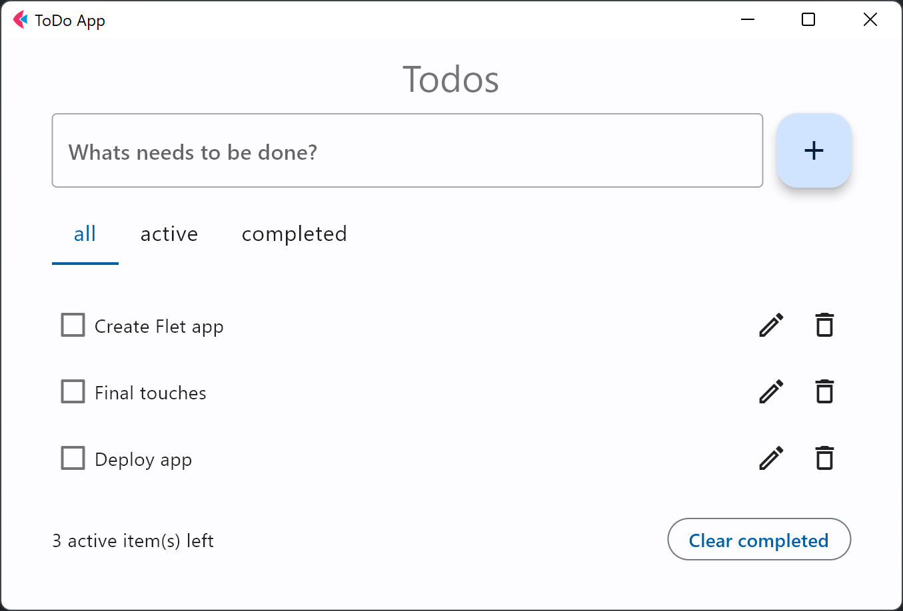
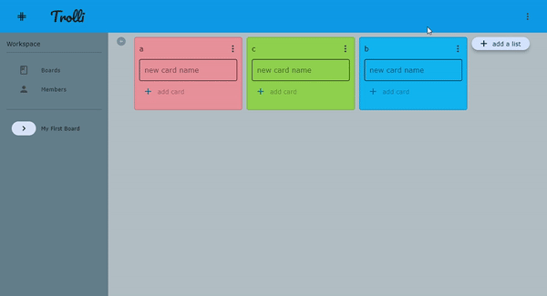

# Tutorials

-   [:octicons-arrow-right-24: `Calculator`](calculator.md)
    
    ---
    {width="100%"}

-   [:octicons-arrow-right-24: `Chat`](chat.md)
    
    ---
    {width="100%"}

-   [:octicons-arrow-right-24: `Solitaire`](solitaire.md)
    
    ---
    {width="100%"}

-   [:octicons-arrow-right-24: `ToDo`](todo.md)
    
    ---
    {width="100%"}

-   [:octicons-arrow-right-24: `Trolli`](trolli.md)
    
    ---
    {width="100%"}

