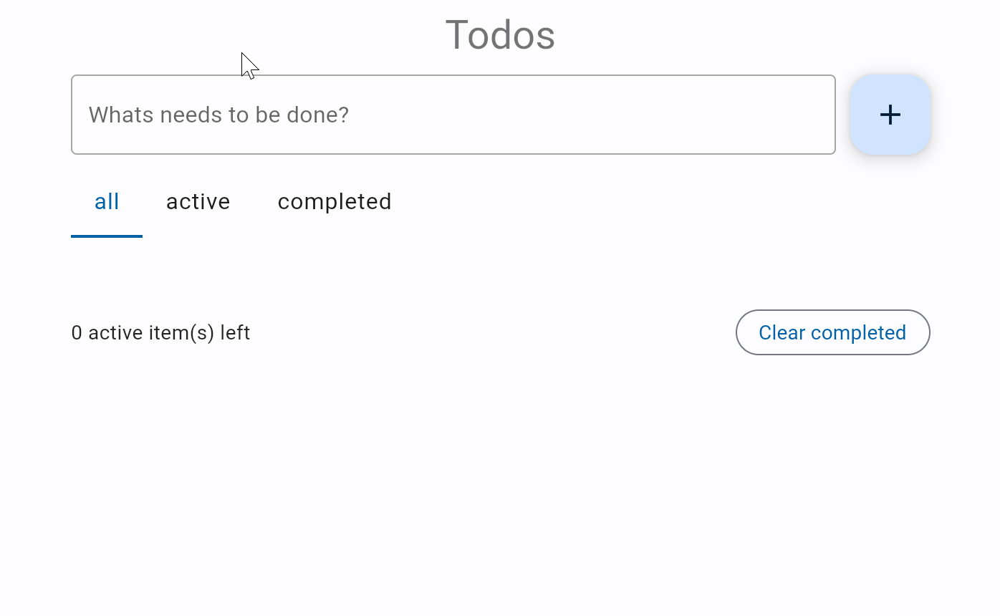
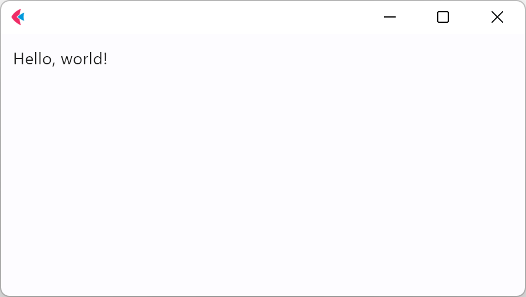
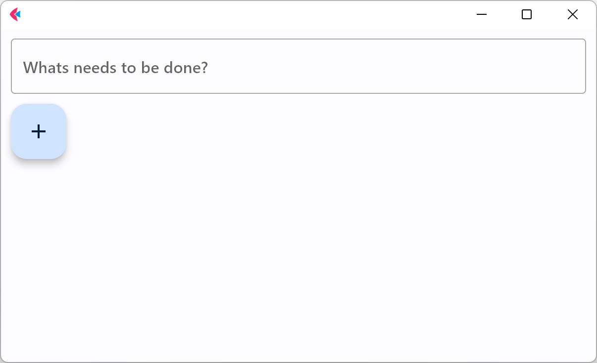
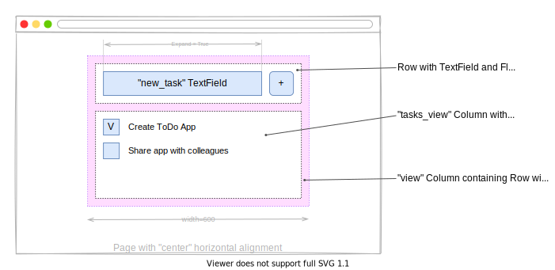
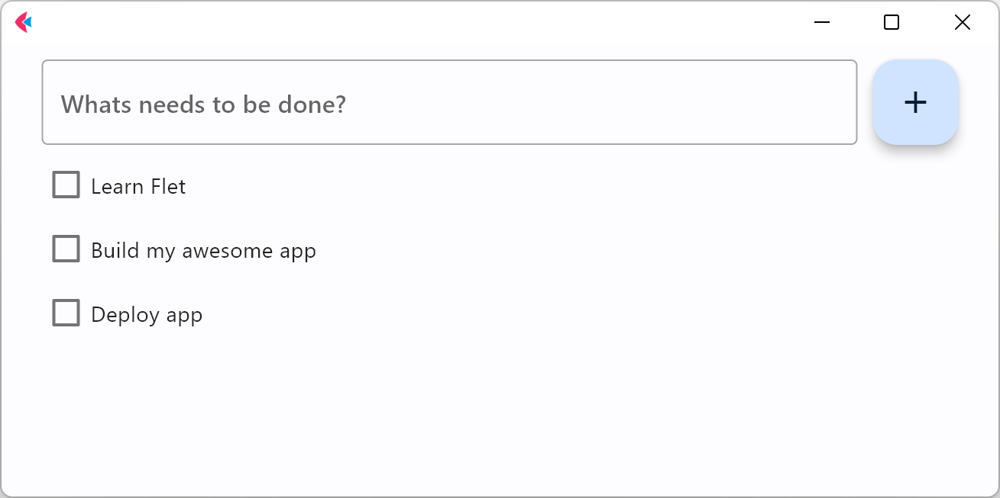
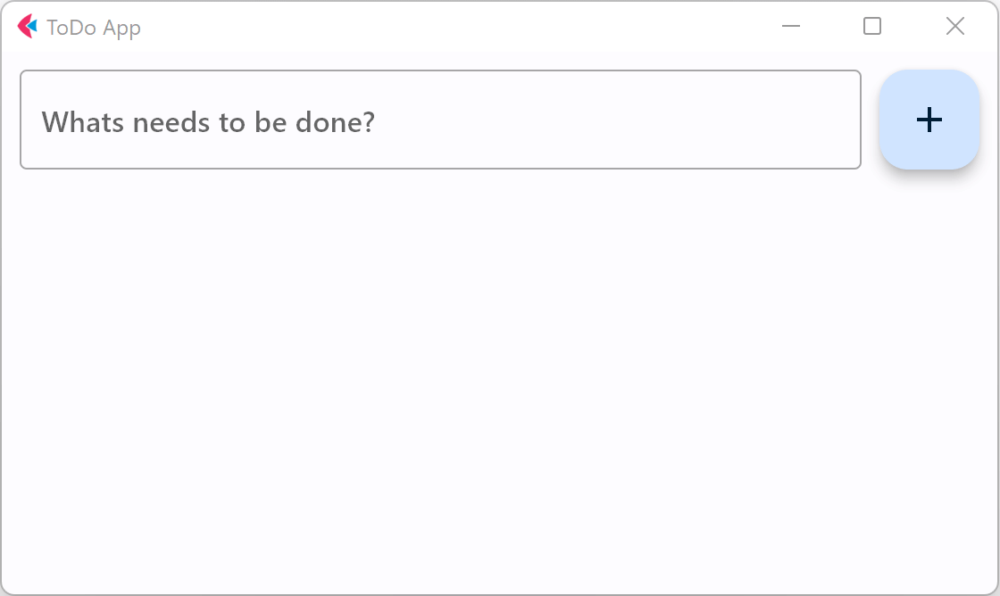
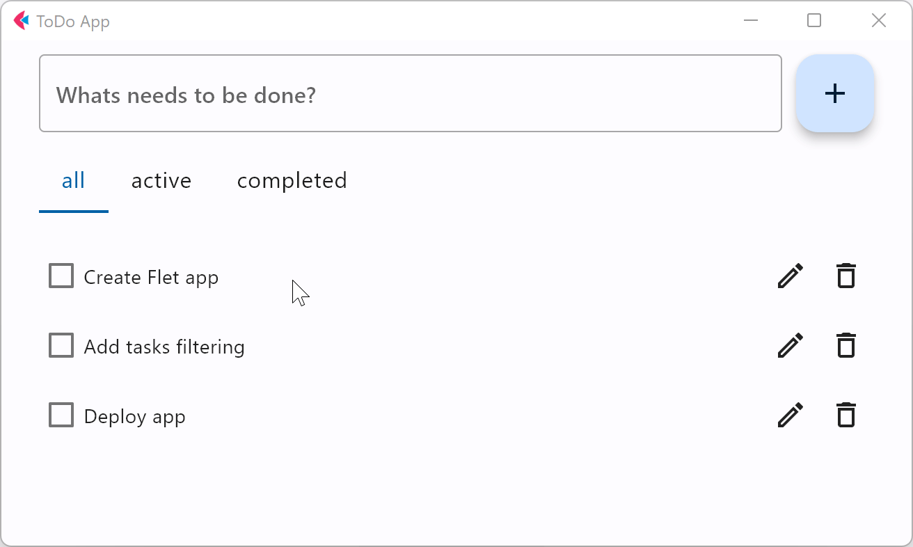
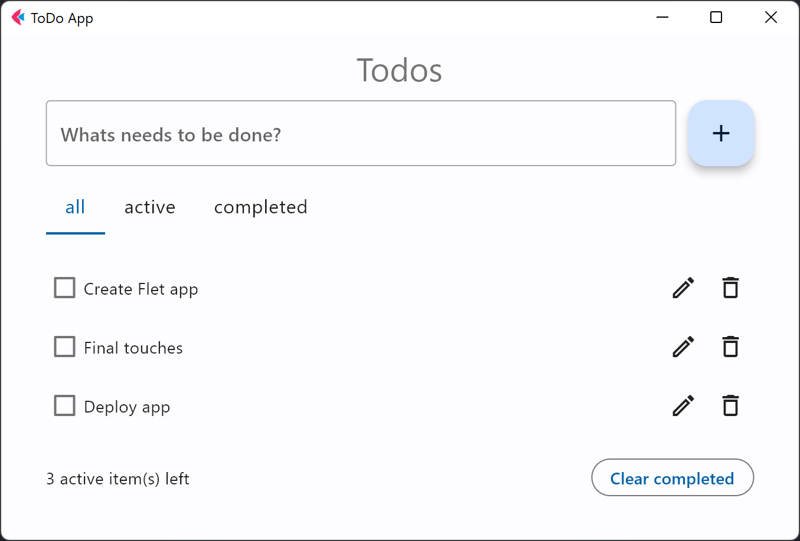

In this tutorial we will show you, step-by-step, how to create a To-Do app in Python using Flet framework and

then publish it as a desktop, mobile or web app. The app is a single-file console program of just
[172 lines (formatted!) of Python code](https://github.com/flet-dev/examples/blob/main/python/apps/todo/todo.py), yet it is a multi-platform application with rich, responsive UI:

{width="80%"}
/// caption
///

You can see the live demo [here](https://gallery.flet.dev/todo/).

We chose a To-Do app for the tutorial, because it covers all of the basic concepts you would need to create a

Flet app: building a page layout, adding controls, handling events, displaying and editing lists,
making reusable UI components, and publishing options.

The tutorial consists of the following steps:

* [Getting started with Flet](#getting-started-with-flet)
* [Adding page controls and handling events](#adding-page-controls-and-handling-events)
* [View, edit and delete list items](#view-edit-and-delete-list-items)
* [Filtering list items](#filtering-list-items)
* [Final touches](#final-touches)
* [Publishing the app](#publishing-the-app)

## Getting started with Flet

To create a multi-platform app in Python with Flet, you don't need to know HTML, CSS or JavaScript, but

you do need a basic knowledge of Python and object-oriented programming.

Before you can create your first Flet app, you need to
[setup your development environment](../getting-started/installation.md).

Once you have Flet installed, let's [create](../getting-started/create-flet-app.md) a simple hello-world app.

Create `hello.py` with the following contents:

```python title="hello.py"
import flet as ft

def main(page: ft.Page):
    page.add(ft.Text(value="Hello, world!"))

ft.run(main)
```

Run this app, and you will see a new window with a greeting:

{width="80%"}
/// caption
///

## Adding page controls and handling events

Now we're ready to create a multi-user To-Do app.

To start, we'll need a [`TextField`][flet.TextField] for entering a task name, and an "+"
[`FloatingActionButton`][flet.FloatingActionButton] with an event handler that will display
a [`Checkbox`][flet.Checkbox] with a new task.

Create `todo.py` with the following contents:

```python title="todo.py"
import flet as ft

def main(page: ft.Page):
    def add_clicked(e):
        page.add(ft.Checkbox(label=new_task.value))
        new_task.value = ""
        page.update()

    new_task = ft.TextField(hint_text="What's needs to be done?")

    page.add(new_task, ft.FloatingActionButton(icon=ft.Icons.ADD, on_click=add_clicked))

ft.run(main)
```

Run the app and you should see a page like this:

{width="80%"}
/// caption
///

### Page layout

Now let's make the app look nice! We want the entire app to be at the top center of the page,
taking up 600 px width. The TextField and the "+" button should be aligned horizontally, and take up full app width:

{width="80%"}
/// caption
///

[`Row`][flet.Row]  is a control that is used to lay its children controls out horizontally on a page.
[`Column`][flet.Column] is a control that is used to lay its children controls out vertically on a page.

Replace `todo.py` contents with the following:

```python title="todo.py"
import flet as ft

def main(page: ft.Page):
    def add_clicked(e):
        tasks_view.controls.append(ft.Checkbox(label=new_task.value))
        new_task.value = ""
        view.update()

    new_task = ft.TextField(hint_text="What needs to be done?", expand=True)
    tasks_view = ft.Column()
    view=ft.Column(
        width=600,
        controls=[
            ft.Row(
                controls=[
                    new_task,
                    ft.FloatingActionButton(icon=ft.Icons.ADD, on_click=add_clicked),
                ],
            ),
            tasks_view,
        ],
    )

    page.horizontal_alignment = ft.CrossAxisAlignment.CENTER
    page.add(view)

ft.run(main)
```

Run the app and you should see a page like this:

{width="80%"}
/// caption
///

### Reusable UI components

While we could continue writing our app in the `main` function, the best practice would be to
create a [reusable UI component](../cookbook/custom-controls.md). Imagine you are working on an app header, a side menu,
or UI that will be a part of a larger project. Even if you can't think of such uses right now,
we still recommend creating all your Flet apps with composability and reusability in mind.

To make a reusable To-Do app component, we are going to encapsulate its state and presentation
logic in a separate class:

```python title="todo.py"
import flet as ft

class TodoApp(ft.Column):
    # application's root control is a Column containing all other controls
    def __init__(self):
        super().__init__()
        self.new_task = ft.TextField(hint_text="What needs to be done?", expand=True)
        self.tasks_view = ft.Column()
        self.width = 600
        self.controls = [
            ft.Row(
                controls=[
                    self.new_task,
                    ft.FloatingActionButton(
                        icon=ft.Icons.ADD, on_click=self.add_clicked
                    ),
                ],
            ),
            self.tasks_view,
        ]

    def add_clicked(self, e):
        self.tasks_view.controls.append(ft.Checkbox(label=self.new_task.value))
        self.new_task.value = ""
        self.update()


def main(page: ft.Page):
    page.title = "To-Do App"
    page.horizontal_alignment = ft.CrossAxisAlignment.CENTER
    page.update()

    # create application instance
    todo = TodoApp()

    # add application's root control to the page
    page.add(todo)

ft.run(main)
```

/// details | Try this out!
    type: example
Try adding two `TodoApp` components to the page:

```python
# create application instance
app1 = TodoApp()
app2 = TodoApp()

# add application's root control to the page
page.add(app1, app2)
```
///

## View, edit and delete list items

In the [previous step](#adding-page-controls-and-handling-events), we created a basic To-Do app with task items shown as checkboxes.
Let's improve the app by adding "Edit" and "Delete" buttons next to a task name. The "Edit" button
will switch a task item to edit mode.

{width="80%"}
/// caption
///

Each task item is represented by two rows: `display_view` row with Checkbox, "Edit" and "Delete"
buttons and `edit_view` row with TextField and "Save" button. `view` column serves as a container
for both `display_view` and `edit_view` rows.

Before this step, the code was short enough to be fully included in the tutorial. Going forward,
we will be highlighting only the changes introduced in a step.

Copy the entire code for this step from [here](https://github.com/flet-dev/examples/blob/main/python/tutorials/todo/to-do-4.py). Below we will explain the changes we've done
to implement view, edit, and delete tasks.

To encapsulate task item views and actions, we introduced a new `Task` class:

```python title="todo.py"
class Task(ft.Column):
    def __init__(self, task_name, task_delete):
        super().__init__()
        self.task_name = task_name
        self.task_delete = task_delete
        self.display_task = ft.Checkbox(value=False, label=self.task_name)
        self.edit_name = ft.TextField(expand=1)

        self.display_view = ft.Row(
            alignment=ft.MainAxisAlignment.SPACE_BETWEEN,
            vertical_alignment=ft.CrossAxisAlignment.CENTER,
            controls=[
                self.display_task,
                ft.Row(
                    spacing=0,
                    controls=[
                        ft.IconButton(
                            icon=ft.Icons.CREATE_OUTLINED,
                            tooltip="Edit To-Do",
                            on_click=self.edit_clicked,
                        ),
                        ft.IconButton(
                            ft.Icons.DELETE_OUTLINE,
                            tooltip="Delete To-Do",
                            on_click=self.delete_clicked,
                        ),
                    ],
                ),
            ],
        )

        self.edit_view = ft.Row(
            visible=False,
            alignment=ft.MainAxisAlignment.SPACE_BETWEEN,
            vertical_alignment=ft.CrossAxisAlignment.CENTER,
            controls=[
                self.edit_name,
                ft.IconButton(
                    icon=ft.Icons.DONE_OUTLINE_OUTLINED,
                    icon_color=ft.Colors.GREEN,
                    tooltip="Update To-Do",
                    on_click=self.save_clicked,
                ),
            ],
        )
        self.controls = [self.display_view, self.edit_view]

    def edit_clicked(self, e):
        self.edit_name.value = self.display_task.label
        self.display_view.visible = False
        self.edit_view.visible = True
        self.update()

    def save_clicked(self, e):
        self.display_task.label = self.edit_name.value
        self.display_view.visible = True
        self.edit_view.visible = False
        self.update()

    def delete_clicked(self, e):
        self.task_delete(self)
```

Additionally, we changed `TodoApp` class to create and hold `Task` instances when the "Add" button is clicked:

```python title="todo.py"
class TodoApp(ft.Column):
    # application's root control is a Column containing all other controls
    def __init__(self):
        super().__init__()
        self.new_task = ft.TextField(hint_text="What needs to be done?", expand=True)
        self.tasks = ft.Column()
        self.width = 600
        self.controls = [
            ft.Row(
                controls=[
                    self.new_task,
                    ft.FloatingActionButton(
                        icon=ft.Icons.ADD, on_click=self.add_clicked
                    ),
                ],
            ),
            self.tasks,
        ]

    def add_clicked(self, e):
        task = Task(self.new_task.value, self.task_delete)
        self.tasks.controls.append(task)
        self.new_task.value = ""
        self.update()

    def task_delete(self, task):
        self.tasks.controls.remove(task)
        self.update()
```

For "Delete" task operation, we implemented `task_delete()` method in `TodoApp` class which
accepts task control instance as a parameter.

Then, we passed a reference to `task_delete` method into Task constructor and called it on
"Delete" button event handler.

Run the app and try to edit and delete tasks:

{width="80%"}
/// caption
///

## Filtering list items

We already have a functional To-Do app where we can create, edit, and delete tasks.
To be even more productive, we want to be able to filter tasks by their status.

Copy the entire code for this step from [here](https://github.com/flet-dev/examples/blob/main/python/tutorials/todo/to-do-5.py). Below we will explain the changes we've done
to implement filtering.

`Tabs` control is used to display filter:

```python title="todo.py"
# ...

class TodoApp(ft.Column):
    # application's root control is a Column containing all other controls
    def __init__(self):
        super().__init__()
        self.new_task = ft.TextField(hint_text="What's needs to be done?", expand=True)
        self.tasks = ft.Column()

        self.filter = ft.Tabs(
            selected_index=0,
            on_change=self.tabs_changed,
            tabs=[ft.Tab(text="all"), ft.Tab(text="active"), ft.Tab(text="completed")],
        )

    # ...
```

To display different lists of tasks depending on their statuses, we could maintain three
lists with "All", "Active" and "Completed" tasks. We, however, chose an easier approach
where we maintain the same list and only change a task's visibility depending on its status.

In `TodoApp` class we overrided [`before_update()`](../cookbook/custom-controls.md#before_update)
method alled every time when the control is being updated. It iterates through all the tasks and updates their `visible`
property depending on the status of the task:

```python title="todo.py"
class TodoApp(ft.Column):

    # ...

    def before_update(self):
        status = self.filter.tabs[self.filter.selected_index].text
        for task in self.tasks.controls:
            task.visible = (
                status == "all"
                or (status == "active" and task.completed == False)
                or (status == "completed" and task.completed)
            )
```

Filtering should occur when we click on a tab or change a task status. `TodoApp.before_update()` method
is called when Tabs selected value is changed or Task item checkbox is clicked:

```python title="todo.py"
class TodoApp(ft.Column):

    # ...

    def tabs_changed(self, e):
        self.update()

    def task_status_change(self, e):
        self.update()

    def add_clicked(self, e):
        task = Task(self.new_task.value, self.task_status_change, self.task_delete)
    # ...

class Task(ft.Column):
    def __init__(self, task_name, task_status_change, task_delete):
        super().__init__()
        self.completed = False
        self.task_name = task_name
        self.task_status_change = task_status_change
        self.task_delete = task_delete
        self.display_task = ft.Checkbox(
            value=False, label=self.task_name, on_change=self.status_changed
        )
        # ...

    def status_changed(self, e):
        self.completed = self.display_task.value
        self.task_status_change()
```

Run the app and try filtering tasks by clicking on the tabs:

{width="80%"}
/// caption
///

## Final touches

Our Todo app is almost complete now. As a final touch, we will add a footer (`Column` control)
displaying the number of incomplete tasks (`Text` control) and a "Clear completed" button.

Copy the entire code for this step from [here](https://github.com/flet-dev/examples/blob/main/python/apps/todo/todo.py). Below we highlighted the changes we've
done to implement the footer:

```python title="todo.py"
class TodoApp():
    def __init__(self):
        # ...

        self.items_left = ft.Text("0 items left")

        self.width = 600
        self.controls = [
            ft.Row(
                [ft.Text(value="Todos", theme_style=ft.TextThemeStyle.HEADLINE_MEDIUM)],
                alignment=ft.MainAxisAlignment.CENTER,
            ),
            ft.Row(
                controls=[
                    self.new_task,
                    ft.FloatingActionButton(
                        icon=ft.Icons.ADD, on_click=self.add_clicked
                    ),
                ],
            ),
            ft.Column(
                spacing=25,
                controls=[
                    self.filter,
                    self.tasks,
                    ft.Row(
                        alignment=ft.MainAxisAlignment.SPACE_BETWEEN,
                        vertical_alignment=ft.CrossAxisAlignment.CENTER,
                        controls=[
                            self.items_left,
                            ft.OutlinedButton(
                                text="Clear completed", on_click=self.clear_clicked
                            ),
                        ],
                    ),
                ],
            ),
        ]

    # ...

    def clear_clicked(self, e):
        for task in self.tasks.controls[:]:
            if task.completed:
                self.task_delete(task)

    def before_update(self):
        status = self.filter.tabs[self.filter.selected_index].text
        count = 0
        for task in self.tasks.controls:
            task.visible = (
                status == "all"
                or (status == "active" and task.completed == False)
                or (status == "completed" and task.completed)
            )
            if not task.completed:
                count += 1
        self.items_left.value = f"{count} active item(s) left"
```
Run the app:

{width="80%"}
/// caption
///

## Publishing the app

Congratulations! You have created your first Python app with Flet, and it looks awesome!

Now it's time to share your app with the world!

[Follow these instructions](../publish/index.md) to publish your Flet app as a mobile, desktop or web app.

## Summary

In this tutorial, you have learnt how to:

* Create a simple Flet app;
* Work with [Reusable UI components](../cookbook/custom-controls.md);
* Design UI layout using [`Column`][flet.Column] and [`Row`][flet.Row] controls;
* Work with lists: view, edit and delete items, filtering;
* [Publish](../publish/index.md) your Flet app to multiple platforms;

For further reading you can explore [controls](../controls/index.md) and [examples repository](https://github.com/flet-dev/examples/tree/main/python).
