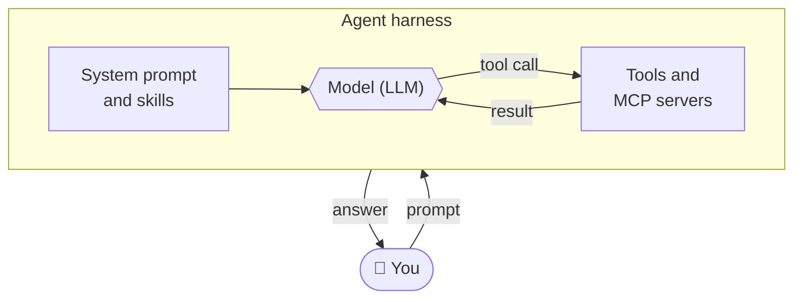
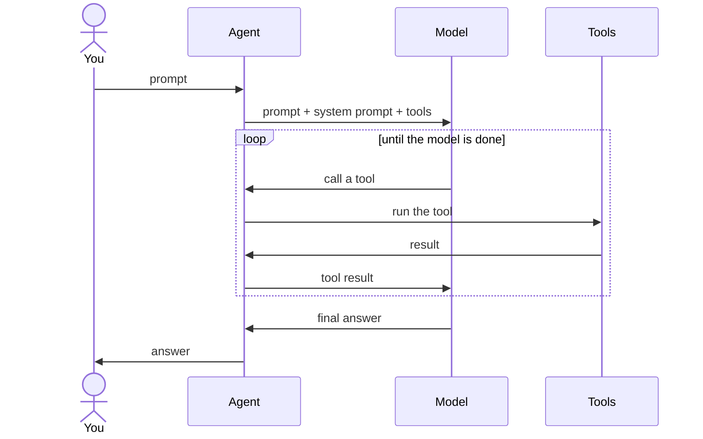
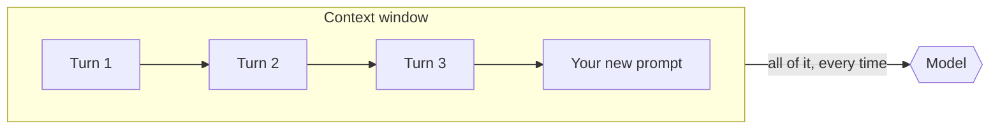
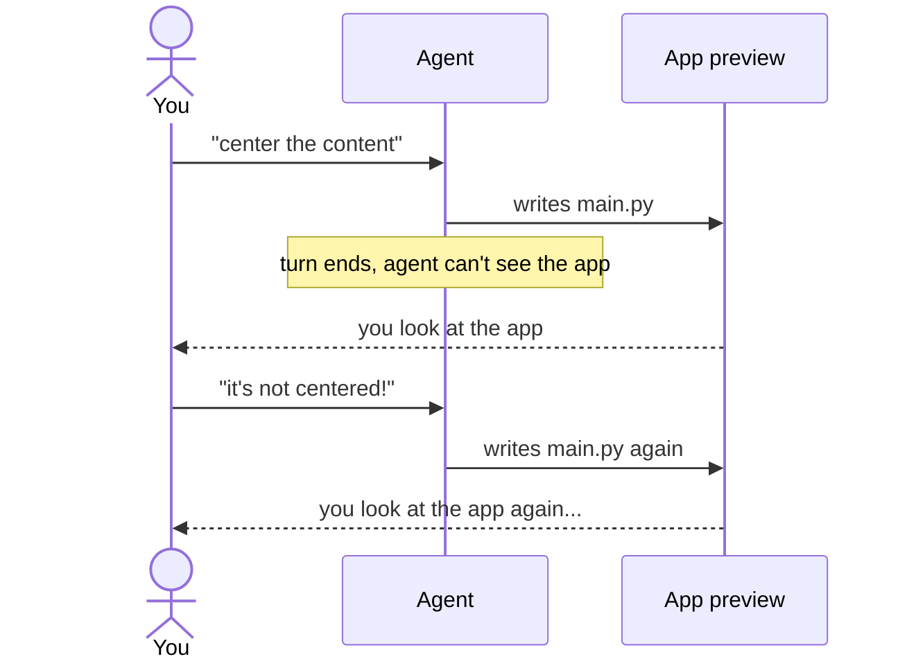
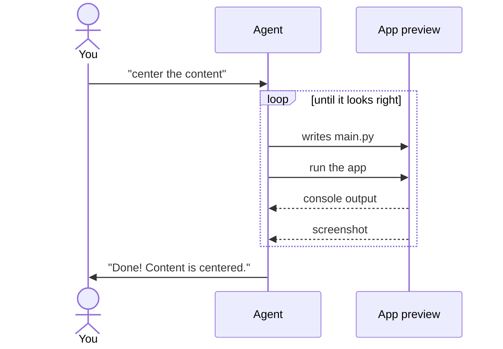

Building an AI agent is exciting. Seeing people actually use it and get the results they wanted
is even more exciting. And seeing early adopters go beyond the free plan and subscribe to the
Creator plan - that's the best part. Thank you for your support!

Today's release of [Flet Studio](https://studio.flet.dev) makes the agent a lot less blind:
it can now **run your app, take a screenshot of it and read its console** - all in the middle
of its work, without asking you. You can also attach pictures, PDFs and code files to your
messages, or just paste a screenshot.

{/* truncate */}

## A two-minute primer on AI agents

You can find an infinite number of articles about "what an AI agent is" or "how to build your
own agent", but I'd like to quickly recap it here and establish some terminology, so we speak
the same language here and in other places of the Flet docs.

### The agent loop

In short, an agent is a loop with an LLM (or simply "model") in the middle, surrounded by
prompts, skills, MCP servers and tools. Everything around the model is often called a
**harness**: it gives the model knowledge it doesn't have and keeps its "creativity" (read:
hallucinations) in check.

### Turns

You send a prompt and a new **turn** starts. The prompt, together with the system prompt and
available tools, goes to the model. The model either answers right away or asks the agent to
call a tool - list files, read the Flet API docs, write `main.py`. The agent calls the tool and
sends the result back to the model, which decides what to do next. This repeats until the model
has nothing more to do and gives you its final answer. That's the end of the turn.

### Conversations and the context window

Send another prompt and all previous turns - your prompts, the model's tool calls, their results
and answers - are sent along with it. The model has no memory of its own, so the whole history
goes back to it every time.

The sum of all turns is a **conversation**, or **context**, which the agent UI usually calls a
"chat".

How long a conversation can be is limited by the model's maximum context window size. That's
also why every extra turn costs more than the previous one - more tokens are sent each time.

## Building UI blindfolded

Developing an agent is a challenge. An LLM is non-deterministic, so if you ask it 10 times to
"build a counter app", you get 10 different, but plausible, results. Prompts and skills narrow
it down, and the tools define what the agent can actually do.

The first iteration of the Flet agent had only tools for manipulating files in the app
workspace: list directories, read and write files. The information flowed in one direction -
from the model to the app workspace.

OK, let's give the agent a brain (the model) and a pen (the workspace tools) and see what
happens!

> 🙂 Build a counter app with plus and minus buttons.
>
> 🤖 *(checks the Flet API, thinks for a minute, writes `main.py`)* Here, I built a simple
> counter app with plus and minus buttons.
>
> 😐 There is no minus button.
>
> 🤖 *(checks the Flet API again, thinks for a few seconds, updates `main.py`)* I added the
> missing minus button.
>
> 😕 There is a Python error about a missing import.
>
> 🤖 *(changes `main.py`)* My apologies, I used an incorrect import. It's fixed now.
>
> 🙂 OK. Now, put the app content at the center of the page.
>
> 🤖 *(thinks, changes `main.py`)* I centered the app content on the page.
>
> 😠 It's not at the center.
>
> 🤖 *(changes `main.py`)* I fixed the app and now it's centered.
>
> 🤬 It's **still** not at the center!
>
> 🤖 *(thinks harder, changes `main.py` again)* I restructured the app to make sure its content
> is at the center of the page.
>
> 🤬 It's not centered, again!!!
>
> 🤖 Could you give me a screenshot of what you see to help me figure out the solution?
>
> 😤 I can't give you a screenshot!!!
>
> *(🚪 user left the chat)*

Dialogs like this could go on for hours. If you are persistent, you can probably finish the job
in a dozen turns. But it's still really annoying, right?

For an agent building UI with nothing but file tools, not being able to see the result is the
biggest gap. The only feedback it gets is you describing, in text, what *you* see. Or it asks
you: "I added some prints to the code - run the app, click here and there, and paste me the
contents of the Console". Doable, but it's unnecessary friction. The human is still constantly
needed in the loop - you are the agent's eyes and ears.

## Closing the loop: eyes and ears

This release fixes both sides of that conversation.

### Attach files and screenshots

You can now attach files to your messages: images, PDFs, and text or code files. Use the
paperclip button, or paste a screenshot from the clipboard with Cmd+V (Ctrl+V on Windows and
Linux). So now you can tell the agent "build a form like the one in the attached picture" or
"this button doesn't look like I described - see attached".

Attachments work on the New app page too, so you can start a new app straight from a mockup.
And the agent can put an attached file into your app - for example, "use this image as the
logo".

### Three new tools

The agent itself gets three new tools, and they take it to the next level:

* **Run the app** - previously, the app was run once, automatically, after each agent turn. Now
  the agent can re-run it any number of times in the middle of a turn. You'll see the Preview
  restart when it does.
* **Take a screenshot** - the agent's eyes. It looks at the running app and sees whether that
  avatar is really in the corner.
* **Read the console** - the agent's ears. Python errors, tracebacks and log messages no longer
  need to be copy-pasted by you.

## The new agent in action

With the new tools, conversations get shorter and reach the result without your intervention.

### Catching Python errors

> 🙂 Build a simple dashboard.
>
> 🤖
> 1. Checks the Flet API
> 2. Writes `main.py`
> 3. **Runs the app**
> 4. **Reads the console** - there's an error!
> 5. Fixes `main.py`
> 6. **Reads the console** - no errors
> 7. Done!
>
> 😄

### Fixing the layout

> 🙂 Build a page with a user avatar in the bottom right corner of the screen.
>
> 🤖
> 1. Writes `main.py`
> 2. **Takes a screenshot** - the avatar is not in the corner
> 3. Checks the Flet API
> 4. Fixes `main.py`
> 5. **Takes a screenshot** - the avatar is in the right place now
> 6. Done!
>
> 😄

### Debugging together

Some bugs only show up when you click through the app. The agent can't click (yet), but it can
set a trap and read what it caught:

> 🙂 I have issues with my app...
>
> 🤖
> 1. Adds logging messages to `main.py`
> 2. **Runs the app**
> 3. "I've added logging messages in various places of your program. Please click through the
>    app and let me know when you're done."
>
> 🙂 OK, done.
>
> 🤖
> 1. **Reads the console**
> 2. Fixes the issues in `main.py` and removes the logging messages
> 3. **Runs the app**
> 4. Done!
>
> 😄

With proper feedback, the agent finishes the job in one turn instead of ten - fewer turns
means fewer tokens, fewer credits spent, and no babysitting.

## Also in this release

* **Better-organized apps.** New apps keep their code in a `src` folder, Flet's standard
  layout, and split it into files by what they do. Small apps stay in a single file. New apps
  also come with logging set up, which the agent uses for debugging.
* The agent is better at **layout**, such as centering content or keeping a footer at the
  bottom of the page.
* When your app **calls a web API**, the agent writes code that works both in the Preview and in
  the app you build with `flet build`.
* The **Expert** agent now runs on a newer model, and Flet Studio uses **Flet 1.0.3**.
* Long tasks no longer stop partway because the agent made too many steps.

See [What's new in Flet Studio](/docs/studio/whats-new) for the full list.

## What's next

It would be great to give the agent an ability to tap, swipe, drag and do other interactions
in a running app - with some guardrails, of course: we can't let the agent delete something in
your production database.

A self-learning agent with memory is another thing we could tackle in future releases.

That's all for today! Open [Flet Studio](https://studio.flet.dev) and give the new agent a try.
If you have an interesting story to share - what you built or tried to build with the Flet
agent, challenges, obstacles - tell us in
[GitHub Discussions](https://github.com/flet-dev/flet/discussions) or on
[Discord](https://discord.gg/dzWXP8SHG8).

Happy Flet-ing!
